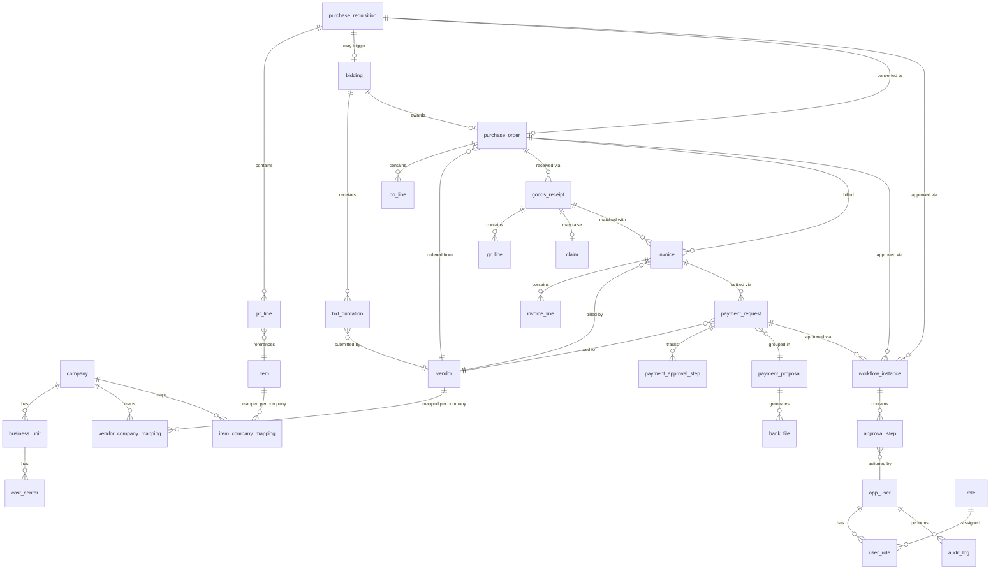
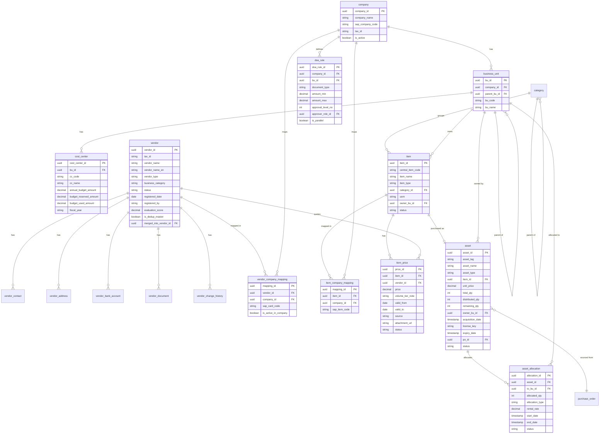
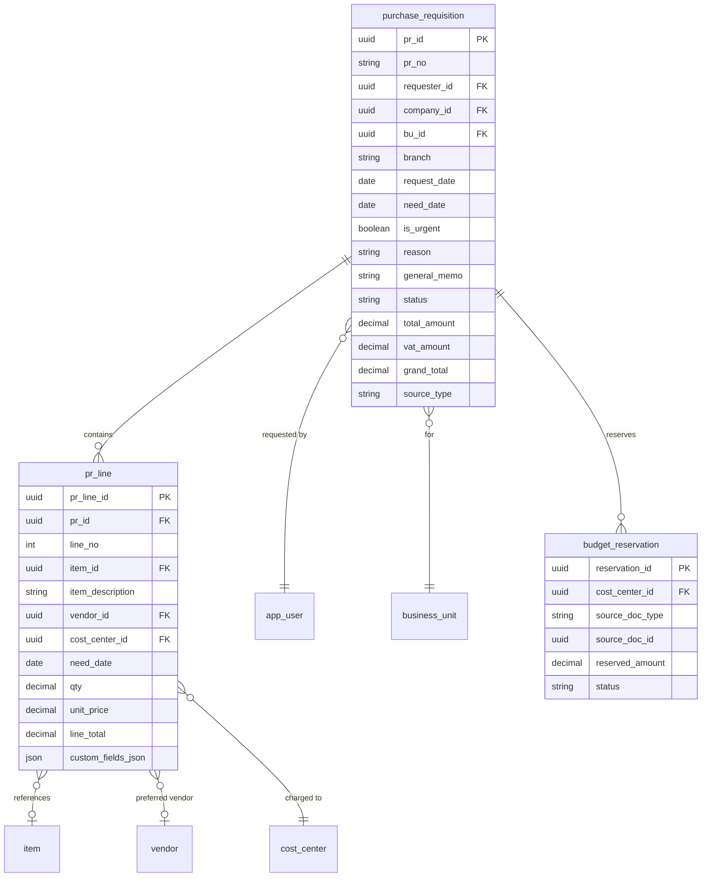
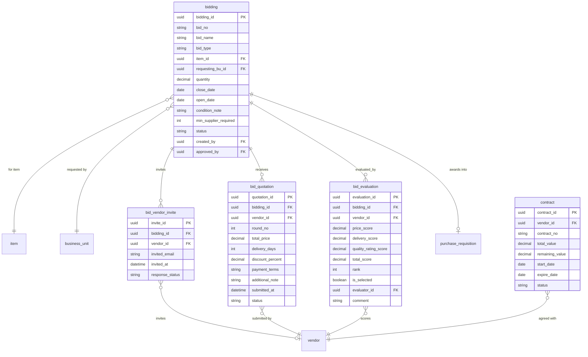
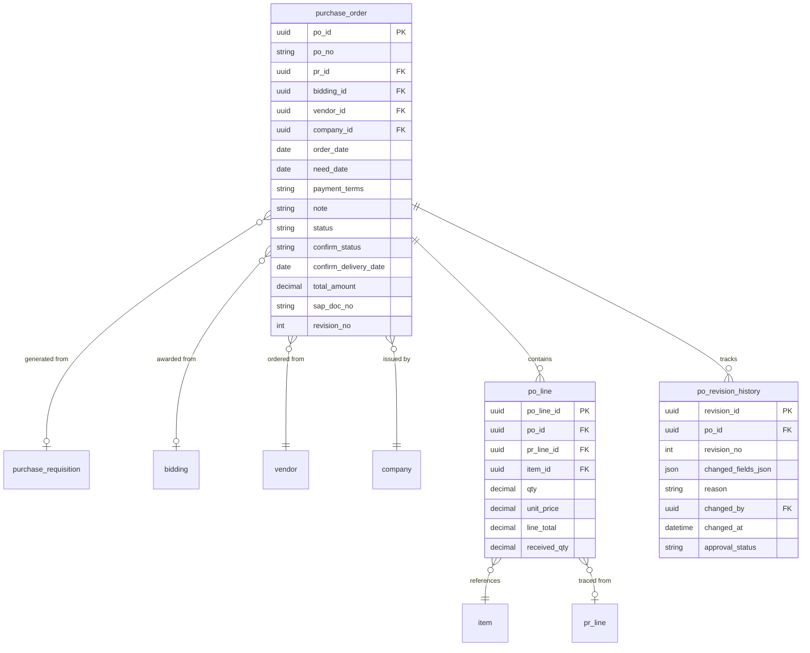
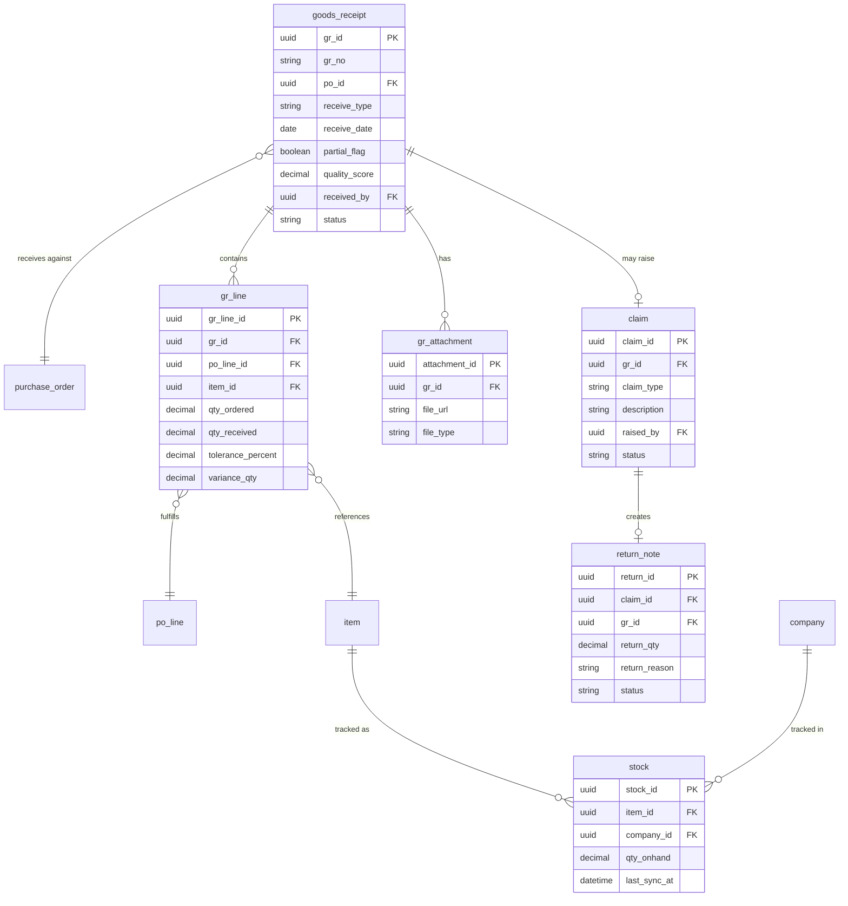
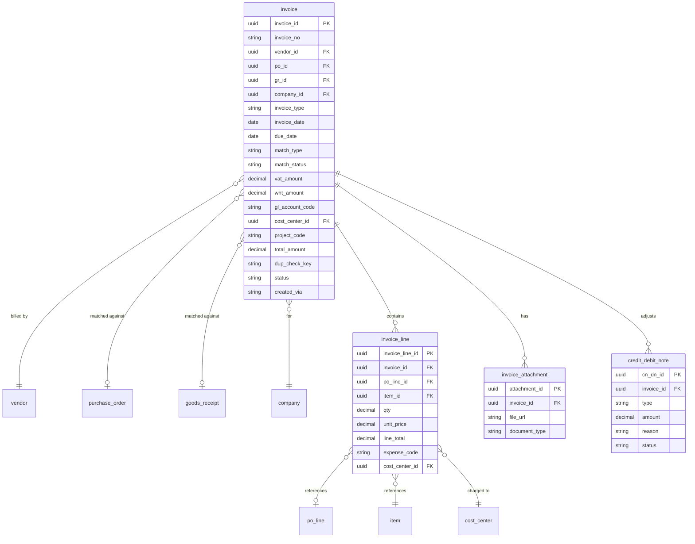
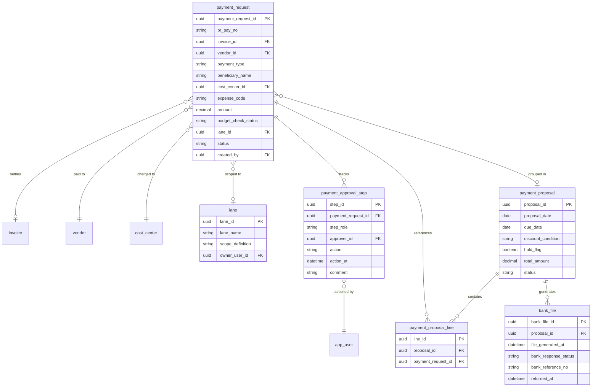
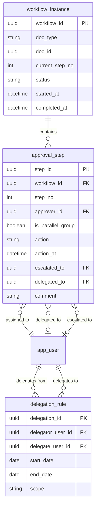
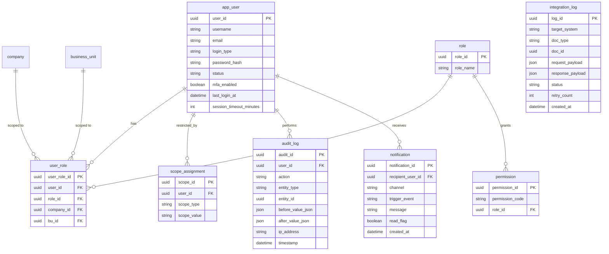

# Data Model (ERD) — e-Procurement / P2P System
## SCGJWD Procurement Vendor Register (PJ250051)

| รายการ | รายละเอียด |
|---|---|
| Project Code | PJ250051 |
| เอกสาร | Data Model (Entity Relationship Diagram) ของระบบทั้งหมด |
| ขอบเขต | Phase 1 — P2P Core MVP เป็นหลัก พร้อม mark Field/Entity ที่ขยายใน Phase 2-4 |
| ใช้สำหรับ | Build Prototype (Antigravity) — ใช้คู่กับ User_Flow.md, Screen Inventory, Design Language |
| อ้างอิงเอกสารต้นทาง | TOR_P2P_Function_Requirement_VD2.00.1 (3 ชีท), Business Solution & Design (Screen Mockup จริง), User_story_phase1.md, Project Overview |
| Naming Convention | table/field = snake_case (พร้อมใช้ implement เป็น SQL Schema ตรง) |
| Version | VD01.00.00 |

> เอกสารนี้สอดคล้องกับ State ที่นิยามไว้ใน `User_Flow.md` ทุกจุด (สถานะของ PR/PO/Bidding/GR/Invoice/Payment/Vendor ใช้ชื่อเดียวกัน) เพื่อให้ Flow ↔ Data ตรงกัน 100% ตอน Implement

---

## สารบัญ

1. [หลักการออกแบบ (Design Principles)](#1-หลักการออกแบบ-design-principles)
2. [ERD Overview — ภาพรวมทั้งระบบ](#2-erd-overview--ภาพรวมทั้งระบบ)
3. [Domain 1: Master Data](#3-domain-1-master-data)
4. [Domain 2: Procurement (PR)](#4-domain-2-procurement-pr)
5. [Domain 3: Sourcing & Bidding](#5-domain-3-sourcing--bidding)
6. [Domain 4: Purchase Order](#6-domain-4-purchase-order)
7. [Domain 5: Goods Receipt & Claim](#7-domain-5-goods-receipt--claim)
8. [Domain 6: Invoice & Accounts Payable](#8-domain-6-invoice--accounts-payable)
9. [Domain 7: Payment](#9-domain-7-payment)
10. [Domain 8: Workflow & Approval](#10-domain-8-workflow--approval)
11. [Domain 9: Security & Admin](#11-domain-9-security--admin)
12. [Cross-Domain Relationship Table](#12-cross-domain-relationship-table)
13. [Enum / Status Value Reference](#13-enum--status-value-reference)
14. [Naming Convention & Multi-Company Strategy](#14-naming-convention--multi-company-strategy)
15. [Phase Tagging (Phase 1 vs Phase 2-4)](#15-phase-tagging-phase-1-vs-phase-2-4)
16. [Assumption & Open Items สำหรับ Prototype](#16-assumption--open-items-สำหรับ-prototype)

---

## 1. หลักการออกแบบ (Design Principles)

1. **Central Code + Per-Company Mapping** — ทุก Entity ที่ต้องใช้ข้าม ~15 บริษัท (Vendor, Item) มีรหัสกลาง (`central_code`/`vendor_id`) 1 ตัว แล้วแตก Mapping Table ผูกรหัส SAP B1 ที่ต่างกันต่อบริษัท (จาก TOR: "1 Item/Vendor ถ้าคนละบริษัท ตอนลง ERP จะใช้คนละรหัสกัน")
2. **Golden Record Pattern** สำหรับ Vendor — มี Unique Key คือ `tax_id`, รองรับ Deduplication, Merge/Split, และ Status Lifecycle เดียวที่ใช้ทุก BU
3. **Document Header + Line Pattern** — ทุกเอกสารทำธุรกรรม (PR/PO/GR/Invoice) แยก Header (สถานะ/วันที่/ผู้เกี่ยวข้อง) กับ Line (รายการสินค้า) เพื่อรองรับหลายบรรทัด/หลายหน่วยงานในเอกสารเดียว
4. **Polymorphic Workflow** — `workflow_instance`/`approval_step` ใช้ `doc_type` + `doc_id` อ้างอิงได้กับทุกเอกสาร ไม่ต้องสร้าง Approval Table แยกต่อโมดูล
5. **Soft Status, ไม่ Hard Delete** — ทุก Entity หลักใช้ field `status` แทนการลบจริง เพื่อรักษา Audit Trail (สอดคล้องกับ TOR No.123 Audit Trail ครบทุกกิจกรรม)
6. **Custom Fields ผ่าน JSON** — PR/PO Custom Columns ที่ต่างกันตาม BU (TOR No.64, No.49) เก็บเป็น `custom_fields_json` แทนการเพิ่มคอลัมน์ตายตัว เพื่อไม่กระทบ Schema เดิมเวลาขยาย BU ใหม่
7. **Dedup Key Pattern** — Vendor (`tax_id`) และ Invoice (`doc_no+vendor_id+date+amount`) มี Computed Key สำหรับตรวจซ้ำก่อน Insert จริง

---

## 2. ERD Overview — ภาพรวมทั้งระบบ

> Diagram นี้แสดง "เส้นทางหลัก" ของข้อมูลเท่านั้น (ไม่ใส่ทุก Field) — รายละเอียด Attribute ครบทุก Entity อยู่ใน Domain 1-9 ด้านล่าง

### 2.1 ตารางสรุปจำนวน Entity ต่อ Domain

| Domain | จำนวน Entity | กลุ่มหลัก |
|---|---|---|
| 1. Master Data | 14 | Company, BU, Cost Center, Vendor (+5 ลูก), Item (+3 ลูก), Asset, DOA Rule |
| 2. Procurement | 3 | PR, PR Line, Budget Reservation |
| 3. Sourcing & Bidding | 5 | Bidding, Invite, Quotation, Evaluation, Contract |
| 4. Purchase Order | 3 | PO, PO Line, PO Revision History |
| 5. Goods Receipt | 6 | GR, GR Line, GR Attachment, Claim, Return Note, Stock |
| 6. Invoice & AP | 4 | Invoice, Invoice Line, Invoice Attachment, Credit/Debit Note |
| 7. Payment | 6 | Payment Request, Approval Step, Proposal, Proposal Line, Bank File, Lane |
| 8. Workflow | 3 | Workflow Instance, Approval Step, Delegation Rule |
| 9. Security & Admin | 8 | User, Role, User Role, Permission, Scope, Audit Log, Integration Log, Notification |
| **รวม** | **52** | |

---

## 3. Domain 1: Master Data

### 3.1 ตาราง Attribute โดยละเอียด

#### `company`
| Field | Type | Key | คำอธิบาย | TOR Ref |
|---|---|---|---|---|
| company_id | uuid | PK | รหัสบริษัทในเครือ (รองรับ ~15 บริษัท) | No.128 |
| company_name | string | | ชื่อบริษัท | |
| sap_company_code | string | | รหัสบริษัทใน SAP B1 | No.25 |
| tax_id | string | | เลขผู้เสียภาษีนิติบุคคล | |
| is_active | boolean | | ใช้งานอยู่หรือไม่ | |

#### `business_unit`
| Field | Type | Key | คำอธิบาย | TOR Ref |
|---|---|---|---|---|
| bu_id | uuid | PK | รหัส BU | No.129 |
| company_id | uuid | FK → company | บริษัทเจ้าของ BU | |
| parent_bu_id | uuid | FK → business_unit (self) | โครงสร้าง Hierarchy ของ BU | No.129 |
| bu_code / bu_name | string | | รหัส/ชื่อ BU | |

#### `cost_center`
| Field | Type | Key | คำอธิบาย | TOR Ref |
|---|---|---|---|---|
| cost_center_id | uuid | PK | รหัสศูนย์ต้นทุน | No.130 |
| bu_id | uuid | FK → business_unit | | |
| cc_code / cc_name | string | | รหัส/ชื่อศูนย์ต้นทุน | |
| annual_budget_amount | decimal | | วงเงินงบประมาณรายปี | No.34,101 |
| budget_reserved_amount | decimal | | ยอดที่ถูกกันไว้ (จาก PR/PO ที่ Approve) — running total | No.101 |
| budget_used_amount | decimal | | ยอดที่ใช้จริงแล้ว | No.101 |
| fiscal_year | string | | ปีงบประมาณ | |

#### `vendor` (Golden Record)
| Field | Type | Key | คำอธิบาย | TOR Ref |
|---|---|---|---|---|
| vendor_id | uuid | PK | | |
| tax_id | string | Unique | คีย์หลักของ Deduplication | No.18,29,97 |
| vendor_name / vendor_name_en | string | | ชื่อผู้ขาย | |
| vendor_type | enum | | ผู้ขาย / ผู้รับเหมาแรงงาน / ผู้ให้บริการ | No.12 |
| business_category | string | | หมวดธุรกิจ | No.14 |
| status | enum | | ดู [Enum Reference](#13-enum--status-value-reference) | No.18 |
| registered_date / registered_by | date/string | | วันที่และผู้ลงทะเบียน (Vendor เองหรือ Buyer) | No.8 |
| evaluation_score | decimal | | คะแนนเฉลี่ยสะสมจาก GR Scoring/Evaluation | No.11 |
| is_dedup_master | boolean | | เป็น Master Record หลังรวม/แยกหรือไม่ | No.18 |
| merged_into_vendor_id | uuid | FK → vendor (self, nullable) | กรณีถูก Merge เข้า Vendor อื่น | No.18 |

#### `vendor_contact`, `vendor_address` (1 Vendor : N)
| Field | Type | Key | คำอธิบาย |
|---|---|---|---|
| contact_id / address_id | uuid | PK | |
| vendor_id | uuid | FK → vendor | |
| contact_name, position, email, phone | string | | ผู้ติดต่อ (ตาม Field จริงใน Vendor Register Mockup) |
| address_line, province, postal_code | string | | ที่อยู่ |

#### `vendor_bank_account`
| Field | Type | Key | คำอธิบาย | TOR Ref |
|---|---|---|---|---|
| bank_account_id | uuid | PK | | |
| vendor_id | uuid | FK → vendor | | |
| bank_name, account_no, account_name | string | | ใช้ตรวจ Duplicate (No.97) และทำ Bank File | No.97,116 |
| is_primary | boolean | | บัญชีหลักสำหรับโอนเงิน | |

#### `vendor_document`
| Field | Type | Key | คำอธิบาย | TOR Ref |
|---|---|---|---|---|
| document_id | uuid | PK | | |
| vendor_id | uuid | FK → vendor | | |
| doc_type | enum | | ภ.พ.20 / Book Bank / หนังสือรับรองบริษัท / หนังสือมอบอำนาจ | No.8 |
| file_url | string | | | |
| issue_date / expire_date | date | | ใช้คำนวณแจ้งเตือนล่วงหน้า | No.98 |
| status | enum | | Valid / ExpiringSoon / Expired | No.98 |

#### `vendor_change_history`
| Field | Type | Key | คำอธิบาย | TOR Ref |
|---|---|---|---|---|
| history_id | uuid | PK | | |
| vendor_id | uuid | FK → vendor | | |
| field_changed, old_value, new_value | string | | เก็บ Version การแก้ไขข้อมูลสำคัญ | No.99 |
| changed_by / changed_at | string/datetime | | | |
| approval_status | enum | | ต้องผ่านอนุมัติก่อนมีผลจริง | No.99,127 |

#### `vendor_company_mapping`
| Field | Type | Key | คำอธิบาย | TOR Ref |
|---|---|---|---|---|
| mapping_id | uuid | PK | | |
| vendor_id | uuid | FK → vendor | | No.16 |
| company_id | uuid | FK → company | | |
| sap_card_code | string | | รหัส Vendor ใน SAP B1 **ของบริษัทนี้โดยเฉพาะ** | No.16,25 |
| is_active_in_company | boolean | | | |

#### `item`
| Field | Type | Key | คำอธิบาย | TOR Ref |
|---|---|---|---|---|
| item_id | uuid | PK | | |
| central_item_code | string | Auto-generate | รหัสกลาง | No.1,19 |
| item_name | string | | | No.1 |
| item_type | enum | | Goods / Service | |
| category_id | uuid | FK → category | | No.22 |
| uom | string | | หน่วย | No.1 |
| owner_bu_id | uuid | FK → business_unit | กำหนด Owner BU | No.3 |
| status | enum | | Active / Inactive | |

#### `category`
| Field | Type | Key | คำอธิบาย | TOR Ref |
|---|---|---|---|---|
| category_id | uuid | PK | | No.22 |
| category_name | string | | | |
| parent_category_id | uuid | FK → category (self) | รองรับ Category หลายระดับ | |

#### `item_company_mapping`
| Field | Type | Key | คำอธิบาย | TOR Ref |
|---|---|---|---|---|
| mapping_id | uuid | PK | | |
| item_id | uuid | FK → item | | No.15 |
| company_id | uuid | FK → company | | |
| sap_item_code | string | | รหัส Item ใน SAP B1 **ของบริษัทนี้** | No.15,25 |

#### `item_price`
| Field | Type | Key | คำอธิบาย | TOR Ref |
|---|---|---|---|---|
| price_id | uuid | PK | | |
| item_id | uuid | FK → item | | No.2 |
| vendor_id | uuid | FK → vendor (nullable) | ราคากลางไม่ผูก Vendor ก็ได้ | |
| price | decimal | | | |
| volume_tier_note | string | | เช่น "ราคาเดียวต่อ Volume" + Note อ้างอิง | No.2 |
| valid_from / valid_to | date | | ช่วงเวลาที่มีผล | No.5,6 |
| source | enum | | Manual / OFM / Contract | No.7 |
| attachment_url | string | | ใบเสนอราคาที่แนบ | No.1 |
| status | enum | | Active / ExpiringSoon / Expired | No.5 |

#### `asset`
| Field | Type | Key | คำอธิบาย | TOR Ref |
|---|---|---|---|---|
| asset_id | uuid | PK | ไอดีสินทรัพย์ | |
| asset_tag | string | | รหัสสินทรัพย์ (Asset Tag) | |
| asset_name | string | | ชื่อสินทรัพย์ | |
| asset_type | enum | | Physical / Digital / Service / License | |
| item_id | uuid | FK → item | ลิงก์อ้างอิงกับมาสเตอร์ไอเทม (nullable) | |
| unit_price | decimal | | ราคาทุนต่อหน่วย | |
| total_qty | int | | จำนวนจัดซื้อทั้งหมด | |
| distributed_qty | int | | จำนวนที่ส่งมอบ/เช่าให้หน่วยงานอื่นแล้ว | |
| remaining_qty | int | | จำนวนที่เหลืออยู่ที่ส่วนกลาง (HQ) | |
| owner_bu_id | uuid | FK → business_unit | หน่วยงานเจ้าของสินทรัพย์หลัก | |
| acquisition_date | timestamp | | วันที่เริ่มถือครองสินทรัพย์ | |
| license_key | string | | คีย์ใบอนุญาตสิทธิ์การใช้งาน (nullable) | |
| expiry_date | timestamp | | วันหมดอายุสัญญาหรือลิขสิทธิ์ (nullable) | |
| po_id | uuid | FK → purchase_order | อ้างอิงใบสั่งซื้อ (nullable) | |
| status | enum | | In Stock / Distributed / Rented / Scrapped | |

#### `asset_allocation`
| Field | Type | Key | คำอธิบาย | TOR Ref |
|---|---|---|---|---|
| allocation_id | uuid | PK | ไอดีประวัติจัดสรร | |
| asset_id | uuid | FK → asset | สินทรัพย์ที่ถูกโอนจัดสรร | |
| to_bu_id | uuid | FK → business_unit | หน่วยงานผู้เช่า/ผู้รับโอนสินทรัพย์ | |
| allocated_qty | int | | จำนวนจัดสรร | |
| allocation_type | enum | | Distribution (ส่งมอบ) / Rental (เช่าใช้งานภายใน JWD) | |
| rental_rate | decimal | | อัตราค่าเช่าภายในเครือต่อเดือน | |
| start_date | timestamp | | วันที่เริ่มจัดสรร/ให้เช่า | |
| end_date | timestamp | | วันที่หมดอายุ/สิ้นสุดการจัดสรร (nullable) | |
| status | enum | | Active / Returned / Closed | |

#### `doa_rule`
| Field | Type | Key | คำอธิบาย | TOR Ref |
|---|---|---|---|---|
| doa_rule_id | uuid | PK | | No.103,152 |
| company_id / bu_id | uuid | FK | scope ของกฎ (bu_id null = ทุก BU) | |
| document_type | enum | | PR / PO / Bidding / PaymentRequest | |
| amount_min / amount_max | decimal | | ช่วงวงเงินที่กฎนี้ใช้ | No.35,103 |
| approval_level_no | int | | ลำดับขั้นอนุมัติ | |
| approver_role_id | uuid | FK → role | | |
| is_parallel | boolean | | อนุมัติพร้อมกันหลายคนในขั้นนี้หรือไม่ | No.153 |

---

## 4. Domain 2: Procurement (PR)

### 4.1 ตาราง Attribute โดยละเอียด

#### `purchase_requisition`
| Field | Type | Key | คำอธิบาย | Mockup/TOR Ref |
|---|---|---|---|---|
| pr_id | uuid | PK | | |
| pr_no | string | Unique | เลขที่ PR เช่น "PR2504317" (ตาม Mockup จริง) | Screen |
| requester_id | uuid | FK → app_user | ผู้ขอซื้อ | |
| company_id / bu_id | uuid | FK | | |
| branch | string | | สาขา (Field จริงในฟอร์ม "สร้างรายการขอซื้อใหม่") | Screen |
| request_date / need_date | date | | วันที่ขอซื้อ / วันที่ต้องการ | Screen |
| is_urgent | boolean | | Toggle "ด่วน" ในฟอร์มจริง | Screen |
| reason | string | | เหตุผล | Screen |
| general_memo | string | | บันทึกเพิ่มเติม | Screen |
| status | enum | | ดู Enum Reference (ตรงกับ User_Flow.md state diagram) | |
| total_amount / vat_amount / grand_total | decimal | | ยอดก่อนภาษี/VAT/ยอดสุทธิ (ตาม Footer ในฟอร์มจริง) | Screen |
| source_type | enum | | Catalog / NewRequest / BiddingAward | No.30,32 |

#### `pr_line`
| Field | Type | Key | คำอธิบาย | TOR Ref |
|---|---|---|---|---|
| pr_line_id | uuid | PK | | |
| pr_id | uuid | FK → purchase_requisition | | |
| line_no | int | | ลำดับ (Field จริงในตารางรายการสินค้า) | Screen |
| item_id | uuid | FK → item (nullable) | null ได้กรณีสินค้าใหม่ยังไม่มีใน Master | No.33 |
| item_description | string | | กรณีไม่มีราคาชัดเจน/สินค้าใหม่ | No.33 |
| vendor_id | uuid | FK → vendor (nullable) | | Screen |
| cost_center_id | uuid | FK → cost_center | รองรับหลายศูนย์ต้นทุนในเอกสารเดียว | No.100 |
| need_date | date | | วันที่ต้องการต่อรายการ | Screen |
| qty / unit_price / line_total | decimal | | | Screen |
| custom_fields_json | json | | Dynamic Field ตามประเภทสินค้า/BU | No.49,64 |

#### `budget_reservation`
| Field | Type | Key | คำอธิบาย | TOR Ref |
|---|---|---|---|---|
| reservation_id | uuid | PK | | |
| cost_center_id | uuid | FK → cost_center | | No.101 |
| source_doc_type / source_doc_id | string/uuid | | Polymorphic อ้างถึง PR หรือ PO ที่กันวงเงิน | No.101 |
| reserved_amount | decimal | | | |
| status | enum | | Reserved / Released / Consumed | No.101,102 |

---

## 5. Domain 3: Sourcing & Bidding

### 5.1 ตาราง Attribute โดยละเอียด

#### `bidding`
| Field | Type | Key | คำอธิบาย | TOR/Mockup Ref |
|---|---|---|---|---|
| bidding_id | uuid | PK | | |
| bid_no | string | Unique | เช่น "BID-001" (ตาม Mockup จริง) | Screen |
| bid_name | string | | ชื่อรายการประมูล (Field จริงในฟอร์มสร้าง) | Screen |
| bid_type | enum | | RFQ_Closed (Phase 1) / SealedBid / OpenAuction (Phase 2) | No.41,42 |
| item_id | uuid | FK → item | สินค้าที่ต้องการ | No.40, Screen |
| requesting_bu_id | uuid | FK → business_unit | สาขา/หน่วยงานที่ต้องการ | Screen |
| quantity | decimal | | จำนวนที่ต้องการ | Screen |
| close_date / open_date | date | | วันปิดประมูล / วันเปิด | No.37,e-Bidding No.2 |
| condition_note | string | | เงื่อนไขและรายละเอียดเพิ่มเติม | Screen |
| min_supplier_required | int | default 3 | จำนวน Supplier ขั้นต่ำ | e-Bidding No.2 |
| status | enum | | ดู Enum Reference | |
| created_by / approved_by | uuid | FK → app_user | ผู้สร้าง / คณะกรรมการผู้ Approve เปิดประมูล | e-Bidding No.2 |

#### `bid_vendor_invite`
| Field | Type | Key | คำอธิบาย | TOR Ref |
|---|---|---|---|---|
| invite_id | uuid | PK | | |
| bidding_id | uuid | FK → bidding | | |
| vendor_id | uuid | FK → vendor (nullable) | null ถ้าเชิญด้วย Email ใหม่ที่ยังไม่ลงทะเบียน | No.37 |
| invited_email | string | | | No.37 |
| invited_at | datetime | | | |
| response_status | enum | | Invited / Submitted / Declined | |

#### `bid_quotation`
| Field | Type | Key | คำอธิบาย | TOR/Mockup Ref |
|---|---|---|---|---|
| quotation_id | uuid | PK | | |
| bidding_id / vendor_id | uuid | FK | | No.38 |
| round_no | int | | รองรับการแก้ไขเสนอราคาใหม่ (ต้องสูงกว่าเดิม) | e-Bidding No.2 |
| total_price | decimal | | ราคารวมที่เสนอ (Field จริง) | Screen |
| delivery_days | int | | ระยะเวลาส่งมอบ (Field จริง) | Screen |
| discount_percent | decimal | | ส่วนลด % (Field จริง) | Screen |
| payment_terms | string | | เงื่อนไขการชำระเงิน (Field จริง) | Screen |
| additional_note | string | | | Screen |
| submitted_at | datetime | | | |
| status | enum | | Submitted / Selected / NotSelected / Superseded | |

> **กฎสำคัญ:** Vendor เห็นเฉพาะ `bid_quotation` ของตนเอง (filter โดย `vendor_id = current_user.vendor_id`) — Buyer เห็นทุกแถว (No.38)

#### `bid_evaluation`
| Field | Type | Key | คำอธิบาย | Mockup Ref |
|---|---|---|---|---|
| evaluation_id | uuid | PK | | |
| bidding_id / vendor_id | uuid | FK | | |
| price_score | decimal | | คะแนนด้านราคา (น้ำหนัก 40% ตาม Mockup จริง) | Screen |
| delivery_score | decimal | | คะแนนระยะเวลาส่งมอบ (20%) | Screen |
| quality_rating_score | decimal | | คะแนนคุณภาพ/Rating (40%) | Screen |
| total_score | decimal | | คะแนนรวมถ่วงน้ำหนัก | No.44 |
| rank | int | | ลำดับ | |
| is_selected | boolean | | ผู้ชนะหรือไม่ | |
| evaluator_id | uuid | FK → app_user | | |
| comment | string | | ความคิดเห็นเพิ่มเติมก่อนอนุมัติ (Field จริงในหน้า Bid Approval) | Screen |

#### `contract` (Blanket Agreement — พื้นฐาน Phase 1)
| Field | Type | Key | คำอธิบาย | TOR Ref |
|---|---|---|---|---|
| contract_id | uuid | PK | | No.105 |
| vendor_id | uuid | FK → vendor | | |
| contract_no | string | | | |
| total_value / remaining_value | decimal | | ควบคุมมูลค่าสัญญาคงเหลือ | No.106 |
| start_date / expire_date | date | | แจ้งเตือนต่ออายุสัญญา | No.106 |
| status | enum | | Active / Expired / Renewed | |

---

## 6. Domain 4: Purchase Order

### 6.1 ตาราง Attribute โดยละเอียด

#### `purchase_order`
| Field | Type | Key | คำอธิบาย | Mockup/TOR Ref |
|---|---|---|---|---|
| po_id | uuid | PK | | |
| po_no | string | Unique | เช่น "PO-2023-001" (ตาม Mockup จริง) | Screen |
| pr_id | uuid | FK → purchase_requisition (nullable) | | No.52,132 |
| bidding_id | uuid | FK → bidding (nullable) | ถ้าออกจากผลประมูล | No.39 |
| vendor_id / company_id | uuid | FK | | Screen |
| order_date / need_date | date | | วันที่สั่งซื้อ / วันที่ต้องการรับสินค้า | Screen |
| payment_terms | string | | เงื่อนไขการชำระเงิน (Field จริงในฟอร์ม Create PO) | Screen |
| note | string | | หมายเหตุเพิ่มเติม | Screen |
| status | enum | | ดู Enum Reference | Screen |
| confirm_status / confirm_delivery_date | string/date | | ผลการตอบรับจาก Vendor Portal | No.54,55 |
| total_amount | decimal | | มูลค่ารวม (Field จริงในตาราง PO List) | Screen |
| sap_doc_no | string | | เลขที่เอกสารที่ได้รับกลับจาก SAP B1 | No.119 |
| revision_no | int | | | No.107 |

#### `po_line`
| Field | Type | Key | คำอธิบาย | Mockup Ref |
|---|---|---|---|---|
| po_line_id | uuid | PK | | |
| po_id | uuid | FK → purchase_order | | |
| pr_line_id | uuid | FK → pr_line (nullable) | Traceability กลับไป PR ต้นทาง | No.132 |
| item_id | uuid | FK → item | | Screen |
| qty / unit_price / line_total | decimal | | (Field จริงในฟอร์ม "เพิ่มรายการสินค้า") | Screen |
| received_qty | decimal | | ยอดรับสะสม (Running จาก GR) | |

#### `po_revision_history`
| Field | Type | Key | คำอธิบาย | TOR Ref |
|---|---|---|---|---|
| revision_id | uuid | PK | | No.107 |
| po_id | uuid | FK → purchase_order | | |
| revision_no | int | | | |
| changed_fields_json | json | | เก็บ Before/After ของฟิลด์ที่แก้ | No.107 |
| reason | string | | | |
| changed_by / changed_at | uuid/datetime | | | |
| approval_status | enum | | ต้องผ่านอนุมัติใหม่ (PO Change/Revision Control) | No.107 |

---

## 7. Domain 5: Goods Receipt & Claim

### 7.1 ตาราง Attribute โดยละเอียด

#### `goods_receipt`
| Field | Type | Key | คำอธิบาย | TOR Ref |
|---|---|---|---|---|
| gr_id | uuid | PK | | |
| gr_no | string | Unique | | |
| po_id | uuid | FK → purchase_order | | No.56 |
| receive_type | enum | | Domestic/Foreign/PO/NonPO/GRAfterPayment/ServiceAcceptance | Sheet2 No.2-8 |
| receive_date | date | | | |
| partial_flag | boolean | | | No.108 |
| quality_score | decimal | | ให้คะแนนรับของรายครั้ง | No.58 |
| received_by | uuid | FK → app_user | | |
| status | enum | | ดู Enum Reference | |

#### `gr_line`
| Field | Type | Key | คำอธิบาย | TOR Ref |
|---|---|---|---|---|
| gr_line_id | uuid | PK | | |
| gr_id / po_line_id / item_id | uuid | FK | | |
| qty_ordered / qty_received | decimal | | | No.108 |
| tolerance_percent | decimal | | ค่าความคลาดเคลื่อนที่กำหนด | No.108 |
| variance_qty | decimal | | ผลต่างรับเกิน/ขาด | No.108 |

#### `gr_attachment`
| Field | Type | Key | คำอธิบาย | TOR Ref |
|---|---|---|---|---|
| attachment_id | uuid | PK | | No.57 |
| gr_id | uuid | FK → goods_receipt | | |
| file_url / file_type | string | | รูปหลักฐานรับสินค้า/สินค้าเสียหาย | No.57 |

#### `claim`
| Field | Type | Key | คำอธิบาย | TOR Ref |
|---|---|---|---|---|
| claim_id | uuid | PK | | No.59 |
| gr_id | uuid | FK → goods_receipt | | |
| claim_type | enum | | Claim/Complaint/CorrectiveAction | No.59 |
| description | string | | | |
| raised_by | uuid | FK → app_user | | |
| status | enum | | Open/InProgress/Closed | |

#### `return_note`
| Field | Type | Key | คำอธิบาย | TOR Ref |
|---|---|---|---|---|
| return_id | uuid | PK | | No.60 |
| claim_id / gr_id | uuid | FK | | |
| return_qty / return_reason | decimal/string | | | |
| status | enum | | Pending/Completed | |

#### `stock`
| Field | Type | Key | คำอธิบาย | TOR Ref |
|---|---|---|---|---|
| stock_id | uuid | PK | | No.61 |
| item_id / company_id | uuid | FK | | |
| qty_onhand | decimal | | Sync จาก SAP B1 | No.61 |
| last_sync_at | datetime | | | No.62,63 |

---

## 8. Domain 6: Invoice & Accounts Payable

### 8.1 ตาราง Attribute โดยละเอียด

#### `invoice`
| Field | Type | Key | คำอธิบาย | TOR Ref |
|---|---|---|---|---|
| invoice_id | uuid | PK | | |
| invoice_no | string | Unique | | |
| vendor_id | uuid | FK → vendor | | |
| po_id / gr_id | uuid | FK (nullable) | null ได้กรณี Non-PO | Sheet2 No.18,19 |
| company_id | uuid | FK → company | | |
| invoice_type | enum | | Domestic/Foreign/PO/NonPO/GRAfterPayment | Sheet2 No.9 |
| invoice_date / due_date | date | | | Sheet2 No.1 |
| match_type | enum | | 2Way / 3Way | No.111 |
| match_status | enum | | Pending/Matched/Mismatch | No.69 |
| vat_amount / wht_amount | decimal | | | No.112 |
| gl_account_code | string | | | No.113 |
| cost_center_id / project_code | uuid/string | | | No.113 |
| total_amount | decimal | | | |
| dup_check_key | string | Computed | doc_no + vendor_id + date + amount (ใช้ตรวจซ้ำ) | No.70 |
| status | enum | | ดู Enum Reference | |
| created_via | enum | | KeyIn (Phase 1) / OCR / API (Phase 2+) | Sheet2 No.9 |

#### `invoice_line`
| Field | Type | Key | คำอธิบาย | TOR Ref |
|---|---|---|---|---|
| invoice_line_id | uuid | PK | | |
| invoice_id / po_line_id / item_id | uuid | FK | | |
| qty / unit_price / line_total | decimal | | | |
| expense_code | string | | | No.113 |
| cost_center_id | uuid | FK → cost_center | | No.113 |

#### `invoice_attachment`
| Field | Type | Key | คำอธิบาย | TOR Ref |
|---|---|---|---|---|
| attachment_id | uuid | PK | | Sheet2 No.11 |
| invoice_id | uuid | FK → invoice | | |
| file_url / document_type | string | | รองรับ Document Split & Console, Multi-Document Type | Sheet2 No.11 |

#### `credit_debit_note`
| Field | Type | Key | คำอธิบาย | TOR Ref |
|---|---|---|---|---|
| cn_dn_id | uuid | PK | | No.72 |
| invoice_id | uuid | FK → invoice | | |
| type | enum | | Credit / Debit | |
| amount / reason | decimal/string | | | |
| status | enum | | | |

---

## 9. Domain 7: Payment

### 9.1 ตาราง Attribute โดยละเอียด

#### `payment_request`
| Field | Type | Key | คำอธิบาย | TOR Ref |
|---|---|---|---|---|
| payment_request_id | uuid | PK | | |
| pr_pay_no | string | Unique | | |
| invoice_id | uuid | FK → invoice (nullable) | | Sheet2 No.15-19 |
| vendor_id | uuid | FK → vendor | | |
| payment_type | enum | | Domestic/Foreign/PO/NonPO/AlternativePayee/VendorOnetime | Sheet2 No.15-17,29 |
| beneficiary_name | string | | กรณี Foreign/Alternative Payee | Sheet2 No.16,17 |
| cost_center_id / expense_code | uuid/string | | | Sheet2 No.19 |
| amount | decimal | | | |
| budget_check_status | enum | | Passed / Exceeded | Sheet2 No.27 |
| lane_id | uuid | FK → lane | ขอบเขตงานทีมบัญชี | Sheet2 No.41 |
| status | enum | | ดู Enum Reference | |
| created_by | uuid | FK → app_user | | |

#### `payment_approval_step` (Segregation of Duties)
| Field | Type | Key | คำอธิบาย | TOR Ref |
|---|---|---|---|---|
| step_id | uuid | PK | | |
| payment_request_id | uuid | FK → payment_request | | |
| step_role | enum | | Maker/Verify/ApproveVerify/Confirm/FinanceVerify | No.115, Sheet2 No.247-250 |
| approver_id | uuid | FK → app_user | | |
| action | enum | | Approve / Reject | |
| action_at / comment | datetime/string | | | |

#### `payment_proposal`
| Field | Type | Key | คำอธิบาย | TOR Ref |
|---|---|---|---|---|
| proposal_id | uuid | PK | | No.114 |
| proposal_date / due_date | date | | สร้างตามวันครบกำหนดชำระอัตโนมัติ | No.114, Sheet2 No.1 |
| discount_condition | string | | เงื่อนไขส่วนลดเงินสด | No.114 |
| hold_flag | boolean | | Hold Payment | No.114 |
| total_amount | decimal | | | |
| status | enum | | Draft/Approved/BankFileGenerated | |

#### `payment_proposal_line`
| Field | Type | Key | คำอธิบาย |
|---|---|---|---|
| line_id | uuid | PK | |
| proposal_id / payment_request_id | uuid | FK | ผูก Payment Request เข้ารอบ Proposal เดียวกัน |

#### `bank_file`
| Field | Type | Key | คำอธิบาย | TOR Ref |
|---|---|---|---|---|
| bank_file_id | uuid | PK | | No.116 |
| proposal_id | uuid | FK → payment_proposal | | |
| file_generated_at | datetime | | | |
| bank_response_status | enum | | Success / Failed | No.116 |
| bank_reference_no | string | | | |
| returned_at | datetime | | รับผลโอนกลับเพื่ออัปเดตสถานะอัตโนมัติ | No.116 |

#### `lane`
| Field | Type | Key | คำอธิบาย | TOR Ref |
|---|---|---|---|---|
| lane_id | uuid | PK | | Sheet2 No.41 |
| lane_name / scope_definition | string | | กำหนดขอบเขตงานทีมบัญชี | |
| owner_user_id | uuid | FK → app_user | หัวหน้าทีมผู้กำหนด Lane | Sheet2 No.253 |

---

## 10. Domain 8: Workflow & Approval

### 10.1 ตาราง Attribute โดยละเอียด

#### `workflow_instance` (Polymorphic — ใช้กับทุกเอกสารที่ต้องอนุมัติ)
| Field | Type | Key | คำอธิบาย | TOR Ref |
|---|---|---|---|---|
| workflow_id | uuid | PK | | No.152 |
| doc_type | enum | | PR / PO / Bidding / Invoice / PaymentRequest | |
| doc_id | uuid | | อ้างอิงเอกสารต้นทาง (Polymorphic, ไม่บังคับ FK ตรง) | |
| current_step_no | int | | | No.156 |
| status | enum | | InProgress/Approved/Rejected/Escalated | |
| started_at / completed_at | datetime | | | |

#### `approval_step`
| Field | Type | Key | คำอธิบาย | TOR Ref |
|---|---|---|---|---|
| step_id | uuid | PK | | |
| workflow_id | uuid | FK → workflow_instance | | |
| step_no | int | | | |
| approver_id | uuid | FK → app_user | | |
| is_parallel_group | boolean | | อนุมัติพร้อมกันในขั้นนี้หรือไม่ | No.153 |
| action | enum | | Pending/Approved/Rejected/Delegated/Escalated | |
| action_at / comment | datetime/string | | | No.157 |
| escalated_to | uuid | FK → app_user (nullable) | | No.154 |
| delegated_to | uuid | FK → app_user (nullable) | | No.155 |

#### `delegation_rule`
| Field | Type | Key | คำอธิบาย | TOR Ref |
|---|---|---|---|---|
| delegation_id | uuid | PK | | No.122,155 |
| delegator_user_id / delegate_user_id | uuid | FK → app_user | ผู้มอบ / ผู้รับมอบอำนาจ | |
| start_date / end_date | date | | ช่วงเวลาที่มีผล | |
| scope | string | | จำกัดเฉพาะประเภทเอกสาร (nullable = ทุกประเภท) | |

---

## 11. Domain 9: Security & Admin

### 11.1 ตาราง Attribute โดยละเอียด

#### `app_user`
| Field | Type | Key | คำอธิบาย | TOR Ref |
|---|---|---|---|---|
| user_id | uuid | PK | | |
| username / email | string | | | |
| login_type | enum | | Local / AD (Azure, อิงอีเมล) | Sheet2 No.242,243 |
| password_hash | string | | เฉพาะ Local Login | |
| status | enum | | Active / Locked / Inactive | Sheet2 No.244 |
| mfa_enabled | boolean | | | No.186 |
| last_login_at | datetime | | | |
| session_timeout_minutes | int | | | No.187 |

#### `role` / `user_role`
| Field | Type | Key | คำอธิบาย | TOR Ref |
|---|---|---|---|---|
| role_id | uuid | PK | | |
| role_name | string | | เช่น Requester, Buyer, Approver, Accounting, Finance, Admin | |
| user_role_id | uuid | PK | | |
| user_id / role_id | uuid | FK | | |
| company_id / bu_id | uuid | FK (nullable) | รองรับ Login แยกตาม BU/Multi-Company | No.192 |

#### `permission`
| Field | Type | Key | คำอธิบาย | TOR Ref |
|---|---|---|---|---|
| permission_id | uuid | PK | | |
| permission_code | enum | | CreateRequest/Verify/ApproveVerify/Confirm/FinanceVerify/GlobalSearch/ManageMaster/ManageLane | Sheet2 No.246-253 |
| role_id | uuid | FK → role | | |

#### `scope_assignment`
| Field | Type | Key | คำอธิบาย | TOR Ref |
|---|---|---|---|---|
| scope_id | uuid | PK | | |
| user_id | uuid | FK → app_user | | |
| scope_type | enum | | Company/Amount/ServiceTeam/WithImage/AlternativePayee/VendorOnetime | Sheet2 No.254-259 |
| scope_value | string | | ค่าของ Scope นั้น (เช่น company_id ที่อนุญาต, วงเงินสูงสุด) | |

#### `audit_log`
| Field | Type | Key | คำอธิบาย | TOR Ref |
|---|---|---|---|---|
| audit_id | uuid | PK | | No.123 |
| user_id | uuid | FK → app_user | | |
| action | enum | | Create/Edit/Approve/Cancel/Login/Connect | No.123 |
| entity_type / entity_id | string/uuid | | Polymorphic อ้างถึงเอกสารใดก็ได้ | |
| before_value_json / after_value_json | json | | เก็บ State ก่อน/หลังเปลี่ยนแปลง | No.123 |
| ip_address | string | | | |
| timestamp | datetime | | จัดเก็บย้อนหลังได้ ≥1 ปี | No.174 |

#### `integration_log`
| Field | Type | Key | คำอธิบาย | TOR Ref |
|---|---|---|---|---|
| log_id | uuid | PK | | No.94,121 |
| target_system | enum | | SAP_B1 / Bank / RD / Email / SSO | No.120 |
| doc_type / doc_id | string/uuid | | | |
| request_payload / response_payload | json | | | |
| status | enum | | Success/Failed/Retrying | No.121 |
| retry_count | int | | | No.121 |
| created_at | datetime | | | |

#### `notification`
| Field | Type | Key | คำอธิบาย | TOR Ref |
|---|---|---|---|---|
| notification_id | uuid | PK | | No.90 |
| recipient_user_id | uuid | FK → app_user | | |
| channel | enum | | Email / InApp / Mobile | |
| trigger_event | string | | เช่น "PR_PENDING_APPROVAL", "VENDOR_DOC_EXPIRING" | No.90 |
| message | string | | | |
| read_flag | boolean | | | |
| created_at | datetime | | | |

---

## 12. Cross-Domain Relationship Table

สรุปความสัมพันธ์ที่ "ข้าม Domain" ทั้งหมด เพื่อให้เห็นจุดเชื่อมที่สำคัญที่สุดของระบบในมุมเดียว

| จาก Entity | ไป Entity | Cardinality | ความหมาย |
|---|---|---|---|
| purchase_requisition | pr_line | 1 : N | PR หลายบรรทัด |
| purchase_requisition | bidding | 1 : 0..1 | PR อาจ trigger การเปิดประมูล |
| bidding | purchase_order | 1 : 0..1 | ผลประมูล Award แล้วสร้าง PO ทันที |
| purchase_requisition | purchase_order | 1 : 0..1 | PR ที่ Approve แปลงเป็น PO |
| purchase_order | po_line | 1 : N | PO หลายบรรทัด |
| purchase_order | goods_receipt | 1 : N | 1 PO รับได้หลายครั้ง (Partial) |
| goods_receipt | claim | 1 : 0..1 | รับสินค้าแล้วพบปัญหา |
| purchase_order, goods_receipt | invoice | N : N (ผ่าน Matching) | 3-Way Matching |
| invoice | payment_request | 1 : 1 (ปกติ) | Invoice นำไปขอจ่ายเงิน |
| payment_request | payment_proposal | N : 1 | รวมหลาย Payment Request เป็นรอบจ่ายเดียว |
| payment_proposal | bank_file | 1 : N | สร้างไฟล์โอนเงินต่อรอบ |
| vendor | vendor_company_mapping | 1 : N | 1 Vendor ผูกได้หลายบริษัท (รหัสต่างกัน) |
| item | item_company_mapping | 1 : N | 1 Item ผูกได้หลายบริษัท (รหัสต่างกัน) |
| purchase_requisition, purchase_order, bidding, invoice, payment_request | workflow_instance | 1 : N (polymorphic) | ทุกเอกสารอนุมัติผ่าน Engine กลางเดียวกัน |
| app_user | approval_step | 1 : N | ผู้ใช้คนเดียวอนุมัติได้หลายขั้นตอน/เอกสาร |
| cost_center | budget_reservation | 1 : N | กันวงเงินจากหลายเอกสาร |

---

## 13. Enum / Status Value Reference

รวม Enum ทุกตัวที่ใช้ในระบบไว้ที่เดียว สำหรับ Implement Dropdown/Badge สี (อ้างอิงสีจาก Design Language เดิม: 🟢 Active/Approved/Paid, 🟡 Pending, 🔴 Rejected/Block, 🔵 Draft)

| Entity.Field | ค่าที่เป็นไปได้ | ตรงกับ User_Flow.md |
|---|---|---|
| `vendor.status` | PendingRegistration → UnderReview → Active / Rejected / Suspended / Blocked / Blacklisted | ✅ State 3.1 |
| `purchase_requisition.status` | Draft → BudgetChecked → PendingApproval → Approved / Rejected / BlockedOverBudget → ConvertedToPO / Cancelled | ✅ State 3.2 |
| `bidding.status` | Draft → PendingCommitteeApproval → OpenForQuotation → Closed → UnderEvaluation → Awarded / NoAward / Rejected | ✅ State 3.3 |
| `bid_quotation.status` | Submitted / Selected / NotSelected / Superseded | |
| `purchase_order.status` | AutoGenerated → PendingApproval → Approved / Rejected → SentToVendor → VendorConfirmed → PartiallyReceived / FullyReceived → RevisionRequested → Closed / Cancelled | ✅ State 3.4 |
| `goods_receipt.status` | PendingReceipt → PartialReceipt / FullReceipt → ServiceAccepted → Scored → ClaimRaised → Closed | ✅ State 3.5 |
| `claim.status` | Open / InProgress / Closed | |
| `return_note.status` | Pending / Completed | |
| `invoice.status` | Created → DuplicateCheck(Rejected) / Matching → Matched / MismatchException → TaxValidated → GLAllocated → ReadyForPayment → LinkedToPaymentRequest | ✅ State 3.6 |
| `payment_request.status` | Created → BudgetChecked → PendingApproval / BlockedOverBudget → Verified → ApprovedToConfirm → Confirmed → InPaymentProposal → OnHold → BankFileGenerated → Paid / Failed / Rejected | ✅ State 3.7 |
| `vendor_document.status` | Valid / ExpiringSoon / Expired | |
| `item_price.status` | Active / ExpiringSoon / Expired | |
| `contract.status` | Active / Expired / Renewed | |
| `approval_step.action` | Pending / Approved / Rejected / Delegated / Escalated | |
| `workflow_instance.status` | InProgress / Approved / Rejected / Escalated | |
| `app_user.status` | Active / Locked / Inactive | |
| `app_user.login_type` | Local / AD | |
| `integration_log.status` | Success / Failed / Retrying | |
| `vendor.vendor_type` | ผู้ขาย / ผู้รับเหมาแรงงาน / ผู้ให้บริการ | |
| `bidding.bid_type` | RFQ_Closed (Phase 1) / SealedBid (Phase 2) / OpenAuction (Phase 2) | |
| `invoice.invoice_type` | Domestic / Foreign / PO / NonPO / GRAfterPayment | |
| `payment_request.payment_type` | Domestic / Foreign / PO / NonPO / AlternativePayee / VendorOnetime | |
| `payment_approval_step.step_role` | Maker / Verify / ApproveVerify / Confirm / FinanceVerify | |
| `scope_assignment.scope_type` | Company / Amount / ServiceTeam / WithImage / AlternativePayee / VendorOnetime | |

---

## 14. Naming Convention & Multi-Company Strategy

1. **Table/Field naming:** `snake_case` ทั้งหมด, table เป็นเอกพจน์ (เช่น `vendor` ไม่ใช่ `vendors`) เพื่อให้ตรงกับ Convention ทั่วไปของ Prisma/Drizzle Schema ที่ Antigravity มักสร้างให้
2. **Primary Key:** ใช้ `uuid` ทุก Entity (รองรับ Merge ข้อมูลจาก Multi-environment/Migration ได้ง่ายกว่า Auto-increment Int)
3. **เลขที่เอกสาร (Document Number)** เช่น `pr_no`, `po_no`, `bid_no` เป็นคนละ Field จาก Primary Key — ใช้รูปแบบ `[Prefix][YY][Running]` ตาม Mockup จริงที่เห็น (เช่น PR2504317, PO-2023-001, BID-001)
4. **Multi-Company Pattern (สำคัญที่สุดของระบบนี้):** Entity ที่ใช้ข้าม ~15 บริษัท (Vendor, Item) **ห้าม**เก็บรหัส SAP ไว้ใน Entity หลักตรงๆ ต้องแยกเป็น Mapping Table (`vendor_company_mapping`, `item_company_mapping`) เสมอ เพราะรหัส SAP ต่างกันทุกบริษัท แต่ตัวตน Vendor/Item เป็นรายการเดียวกัน
5. **Polymorphic Reference** ใช้คู่ `(doc_type, doc_id)` สำหรับ `workflow_instance`, `audit_log`, `integration_log` แทนการสร้าง FK ตรงไปยังหลาย Table (ลด Schema Complexity เมื่อมีเอกสารประเภทใหม่เพิ่มเข้ามาในอนาคต)
6. **Custom Fields** เก็บเป็น `json` Column (`custom_fields_json`) ไม่ใช่สร้างคอลัมน์แยกราย BU เพื่อไม่ต้อง Migrate Schema ทุกครั้งที่เพิ่ม BU ใหม่
7. **Money/Decimal:** ทุก field เงิน ใช้ `decimal` (ไม่ใช่ float) เพื่อความถูกต้องทางบัญชี

---

## 15. Phase Tagging (Phase 1 vs Phase 2-4)

| Entity/Field | Phase 1 (Prototype รอบนี้) | ขยายใน Phase ถัดไป |
|---|---|---|
| `bidding.bid_type` | ใช้ `RFQ_Closed` เท่านั้น | Phase 2: `SealedBid`, `OpenAuction`, Multi-round (`round_no` รองรับอยู่แล้วแต่ UI/Logic เต็มรูปเป็น Phase 2) |
| `bid_evaluation` | คะแนน 3 มิติพื้นฐาน (ราคา/ส่งมอบ/คุณภาพ) | Phase 2: Weighted Scoring แบบ Configurable หลายเกณฑ์ |
| Vendor Evaluation เต็มรูป (รายปี, ฟอร์มหลายแบบ, Audit) | ใช้เพียง `vendor.evaluation_score` (cache จาก GR Scoring) | Phase 2: เพิ่ม `vendor_evaluation`, `evaluation_template`, `evaluation_response` แยกตาราง |
| `invoice.created_via` | `KeyIn` เท่านั้น | Phase 4: เปิดใช้ `OCR`, `API` |
| `contract` | Field พื้นฐาน (มูลค่า/วันหมดอายุ) | Phase 2: Digital Signature, Renewal Workflow เต็มรูป |
| AI Touchpoints (9 จุดตาม Roadmap เดิม) | ไม่มี Entity ใน Phase 1 | Phase 4: เพิ่ม Entity เช่น `ai_recommendation`, `ai_price_benchmark`, ผูกกับ `item_price`/`bidding`/`approval_step` ผ่าน field `source: manual\|ai_suggested` |
| Employee-to-Payment (ESS) | ไม่รวมในเอกสารนี้ | Phase 3: Domain ใหม่ทั้งหมด (`travel_request`, `advance_request`, `expense_claim` ฯลฯ) — แยก Database Schema หรือ Module ชัดเจนจาก P2P |
| `payment_request.payment_type = Foreign` | มี Field รองรับแล้ว แต่ Flow ยังไม่ลงรายละเอียดเท่า Domestic | Phase 2: Foreign Payment เต็มรูป (Beneficiary Bank, SWIFT) |
| Custom Dashboard (`notification`/Reporting) | ใช้ List/Table พื้นฐาน | Phase 2: Custom Dashboard Builder, Spend Analytics เต็มรูป |

---

## 16. Assumption & Open Items สำหรับ Prototype

1. **SAP B1 เป็น Mock Layer** — `integration_log` และทุก field ที่ชื่อ `sap_*` (เช่น `sap_card_code`, `sap_item_code`, `sap_doc_no`) ใน Prototype จะถูก Populate ด้วยค่า Mock/Fake แทนการเชื่อมต่อจริง
2. **Multi-Currency** — Phase 1 อนุมานว่าใช้ THB เป็นสกุลเงินหลักทั้งหมด (ไม่มี field `currency` แยกในตารางเงิน) ยกเว้นใน `payment_request` ที่เผื่อ `payment_type = Foreign` ไว้แล้วแต่ยังไม่ลง Logic แปลงสกุลเงินจริง
3. **Soft Delete เท่านั้น** — ไม่มี Entity ใดอนุญาตให้ Hard Delete จริง ทุกการ "ลบ" ทำผ่านเปลี่ยน `status` เป็น Cancelled/Inactive เพื่อรักษา Audit Trail (No.123)
4. **1 BU นำร่องก่อน** — แม้ Schema รองรับ Multi-Company เต็มรูปแบบ (`company`, `vendor_company_mapping`, `item_company_mapping`) แต่ข้อมูล Seed สำหรับ Demo Prototype จะจำกัดไว้ที่ 1-2 บริษัท/BU ตามมติ Pilot
5. **Tax ID เป็น Unique Key ของ Vendor** — Assume ว่าทุก Vendor มี Tax ID ที่ไม่ซ้ำกันเป็นมาตรฐาน (Edge case บุคคลธรรมดาไม่มีเลขผู้เสียภาษีนิติบุคคลยังไม่ได้ลงรายละเอียดใน Phase 1)
6. **Dynamic Field (`custom_fields_json`)** ยังไม่มี Schema Validation ฝั่ง Backend ใน Prototype — เป็น Free-form JSON ที่ Validate ที่ฝั่ง Frontend ก่อน

---

*เอกสารนี้ใช้คู่กับ `User_Flow.md` (Flow และ State การทำงาน) และ Screen Inventory/Design Language ที่ส่งมอบก่อนหน้า เพื่อให้ได้ภาพระบบที่สมบูรณ์ทั้ง Flow, โครงสร้างข้อมูล, และหน้าตา UI สำหรับนำไป Build Prototype ด้วย Antigravity*
