# Screen Inventory — e-Procurement / P2P System
## SCGJWD Procurement Vendor Register (PJ250051)

| รายการ | รายละเอียด |
|---|---|
| Project Code | PJ250051 |
| เอกสาร | Screen Inventory (รายการหน้าจอทั้งหมดของระบบ) |
| ขอบเขต | Phase 1 — P2P Core MVP เป็นหลัก พร้อม mark หน้าที่ขยายใน Phase 2-4 |
| ใช้สำหรับ | Build Prototype (Antigravity) — ใช้คู่กับ `User_Flow.md` และ `Data_Model_(ERD).md` |
| อ้างอิงเอกสารต้นทาง | Business Solution & Design (Screen Mockup จริง 19 หน้า), TOR_P2P_Function_Requirement_VD2.00.1, User_story_phase1.md |
| Screen ID Convention | ตรงกับที่อ้างอิงไว้แล้วใน `User_Flow.md` ส่วนที่ 8 (Flow → Screen Mapping) ทุกตัว |
| จำนวนหน้าทั้งหมด | 43 หน้า (9 กลุ่ม A–I) |
| Version | VD01.00.00 |

> เอกสารนี้คือ Layer ที่ 3 ของชุดเอกสาร Prototype: **User_Flow.md** (พฤติกรรม/Flow) → **Data_Model_(ERD).md** (โครงสร้างข้อมูล) → **PR_Screen_Inventory.md** (หน้าจอ) — ทั้ง 3 ไฟล์อ้างอิง ID/Entity/State ตรงกันทุกจุด

---

## สารบัญ

1. [หลักการจัดกลุ่มและ Numbering Convention](#1-หลักการจัดกลุ่มและ-numbering-convention)
2. [Information Architecture / Sitemap](#2-information-architecture--sitemap)
3. [Master List — ตารางสรุปทั้งหมด 43 หน้า](#3-master-list--ตารางสรุปทั้งหมด-43-หน้า)
4. [กลุ่ม A: Dashboard & Reporting](#4-กลุ่ม-a-dashboard--reporting)
5. [กลุ่ม B: Vendor Management](#5-กลุ่ม-b-vendor-management)
6. [กลุ่ม C: Catalog & Master Data](#6-กลุ่ม-c-catalog--master-data)
7. [กลุ่ม D: Procurement (PR/Bidding/PO)](#7-กลุ่ม-d-procurement-prbiddingpo)
8. [กลุ่ม E: Goods Receipt & Stock](#8-กลุ่ม-e-goods-receipt--stock)
9. [กลุ่ม F: Invoice & Payment](#9-กลุ่ม-f-invoice--payment)
10. [กลุ่ม G: Workflow & Approval](#10-กลุ่ม-g-workflow--approval)
11. [กลุ่ม H: Admin & Security](#11-กลุ่ม-h-admin--security)
12. [กลุ่ม I: Vendor Portal (External)](#12-กลุ่ม-i-vendor-portal-external)
13. [Modal/Tab Consolidation Notes](#13-modaltab-consolidation-notes)
14. [Screen ↔ Data Entity Matrix](#14-screen--data-entity-matrix)
15. [Responsive & Mobile Notes](#15-responsive--mobile-notes)
16. [Build Priority สำหรับ Prototype](#16-build-priority-สำหรับ-prototype)
17. [Assumption & Open Items](#17-assumption--open-items)

---

## 1. หลักการจัดกลุ่มและ Numbering Convention

- **ID Format:** `[กลุ่มตัวอักษร][เลขลำดับ]` เช่น `D2` = กลุ่ม D (Procurement) หน้าที่ 2 — ใช้ตัวเดียวกันทั้ง 3 เอกสาร (Flow/ERD/Screen) ห้ามเปลี่ยนเลขระหว่างทาง
- **Screen Type ที่ใช้:** `List` (ตาราง+filter), `Form/Modal` (ฟอร์มกรอกข้อมูล), `Multi-tab Page` (1 Route หลาย Tab), `Detail/Profile`, `Dashboard`, `Kanban/Inbox`
- **Mockup Reference:** ระบุว่าหน้านี้มี Mockup จริงจากเอกสาร BSD หรือไม่ — `Mockup จริง (BSD p.X)` = ใช้ Field/Layout ตามที่เห็นได้เลย, `Inferred` = ออกแบบใหม่ตาม Design Language เดิม (ยังไม่มีต้นแบบ)
- **Priority:** 🔵 Must-Build (อยู่ใน Demo รอบแรก ~22 หน้า ครอบคลุม Flow หลักครบ) / ⚪ Should (เสริมความสมบูรณ์ แต่ไม่ใช่ Critical Path ของ Demo)
- **Phase:** Phase 1 (ต้องมีวันแรก) / Phase 2+ (ทำ Field พื้นฐานไว้ก่อน แต่ฟังก์ชันเต็มรูปอยู่ Phase ถัดไป)

---

## 2. Information Architecture / Sitemap

Sidebar ออกแบบจาก 9 กลุ่มของ Screen Inventory โดยตรง (ขยายจาก Sidebar ใน Mockup ต้นแบบ ซึ่งยังไม่มีเมนู Invoice/Payment/Workflow — เอกสารนี้เพิ่มกลุ่มที่ขาดให้ครบตาม TOR)

```mermaid
flowchart TD
    ROOT["VendorVerse Procurement<br/>(Sidebar หลัก)"]

    ROOT --> DASH["แดชบอร์ด"]
    DASH --> A1
    DASH --> A2
    DASH --> A3

    ROOT --> VEN["ข้อมูลผู้ขาย"]
    VEN --> B1 --> B2
    VEN --> B3
    VEN --> B4
    VEN --> B5
    VEN --> B6

    ROOT --> CAT["สินค้าและราคา"]
    CAT --> C1 --> C4
    CAT --> C2
    CAT --> C3
    CAT --> C5

    ROOT --> PROC["การจัดซื้อ"]
    PROC --> D1 --> D2
    PROC --> D3
    PROC --> D4
    PROC --> D5 --> D6
    PROC --> D7

    ROOT --> REC["รับสินค้า/สต็อก"]
    REC --> E1 --> E2
    REC --> E3

    ROOT --> FIN["บัญชี/การเงิน"]
    FIN --> F1 --> F2
    FIN --> F3 --> F4
    FIN --> F5
    FIN --> F6

    ROOT --> WF["งานอนุมัติของฉัน"]
    WF --> G1
    WF --> G2
    WF --> G3
    WF --> G4

    ROOT --> ADM["ตั้งค่าระบบ"]
    ADM --> H1
    ADM --> H2
    ADM --> H3
    ADM --> H4
    ADM --> H5

    PORTAL["Vendor Portal<br/>(แยก Subdomain/Login คนละชุด)"] --> I1 --> I2
    PORTAL --> I3
    PORTAL --> I4
    PORTAL --> I5
```

**หมายเหตุสำคัญ:** Vendor Portal (กลุ่ม I) ต้องเป็น **แอปพลิเคชันแยก** จาก Internal App (กลุ่ม A-H) คนละ Login/คนละ Layout เพราะ Vendor ต้องเห็นเฉพาะข้อมูลของตนเองเท่านั้น (Data Scope แยกระดับ Application ไม่ใช่แค่ Filter)

---

## 3. Master List — ตารางสรุปทั้งหมด 43 หน้า

| ID | ชื่อหน้า | กลุ่ม | Persona หลัก | Type | Priority | Phase |
|---|---|---|---|---|---|---|
| A1 | แดชบอร์ดภาพรวม | Dashboard | Buyer, Manager | Dashboard | 🔵 | 1 |
| A2 | ติดตามสถานะเอกสาร | Dashboard | Buyer, Requester | List | 🔵 | 1 |
| A3 | รายงาน Exception | Dashboard | Buyer, Manager | List | ⚪ | 1 |
| B1 | รายชื่อ Vendor | Vendor | Buyer | List (Tabs) | 🔵 | 1 |
| B2 | ลงทะเบียน/แก้ไขข้อมูล Vendor | Vendor | Vendor, Buyer | Form (Tabs) | 🔵 | 1 |
| B3 | ตรวจสอบและอนุมัติ Vendor | Vendor | Buyer | List + Detail | 🔵 | 1 |
| B4 | จัดกลุ่ม Vendor Master (Golden Record) | Vendor | MDM Admin | List | ⚪ | 1 |
| B5 | แจ้งเตือนเอกสาร Vendor หมดอายุ | Vendor | Buyer, Vendor | List | ⚪ | 1 |
| B6 | ประเมินผล Vendor ประจำปี | Vendor | Buyer, Manager | Form/List | ⚪ | 2 |
| C1 | จัดการสินค้าและราคา | Catalog | Buyer, MDM Admin | Multi-tab Page | 🔵 | 1 |
| C2 | ค้นหา/เลือกสินค้าจาก Catalog | Catalog | Requester | List (Card) | 🔵 | 1 |
| C3 | จัดการรหัสสินค้าข้ามบริษัท | Catalog | MDM Admin | List/Form | ⚪ | 1 |
| C4 | ขอเพิ่มสินค้าใหม่ | Catalog | Requester | Modal/Form | ⚪ | 1 |
| C5 | แจ้งเตือนราคาใกล้หมดอายุ | Catalog | Buyer | List | ⚪ | 1 |
| D1 | รายการขอซื้อ (PR List) | Procurement | Requester, Buyer | List (Tabs) | 🔵 | 1 |
| D2 | สร้าง/แก้ไข PR | Procurement | Requester | Modal/Form | 🔵 | 1 |
| D3 | เปรียบเทียบราคา | Procurement | Buyer | List/Table | 🔵 | 1 |
| D4 | เปิดประมูล/RFQ | Procurement | Buyer, Committee | Multi-tab Page | 🔵 | 1 |
| D5 | ใบสั่งซื้อ (PO) | Procurement | Buyer, Approver | Multi-tab Page | 🔵 | 1 |
| D6 | แก้ไข PO หลังอนุมัติ (Revision) | Procurement | Buyer | Form/History | ⚪ | 1 |
| D7 | สัญญา/ข้อตกลงราคา | Procurement | Buyer | List/Form | ⚪ | 1 |
| E1 | บันทึกรับสินค้า (GR) | Receiving | Warehouse | Form/List | 🔵 | 1 |
| E2 | เคลม/คืนสินค้า | Receiving | Warehouse, Buyer | Form/List | ⚪ | 1 |
| E3 | สรุปสต็อกสินค้า | Receiving | Warehouse, Buyer | List/Chart | ⚪ | 1 |
| F1 | สร้างเอกสารวางบิล | Finance | Accounting, Vendor | Form | 🔵 | 1 |
| F2 | ตรวจสอบจับคู่ Invoice | Finance | Accounting | List/Detail | 🔵 | 1 |
| F3 | คำขอชำระเงิน | Finance | Accounting | Form/List | 🔵 | 1 |
| F4 | อนุมัติจ่ายเงิน/Bank File | Finance | Finance, Treasury | List/Approval | ⚪ | 1 |
| F5 | กล่องงานบัญชี (Lane) | Finance | Accounting | Kanban/Inbox | ⚪ | 1 |
| F6 | เครื่องมือช่วยทำเอกสารจำนวนมาก | Finance | Accounting | Utility/Form | ⚪ | 1 |
| G1 | กล่องงานรออนุมัติ (Web) | Workflow | Approver | Inbox | 🔵 | 1 |
| G2 | อนุมัติผ่านมือถือ | Workflow | Approver | Mobile View | 🔵 | 1 |
| G3 | ประวัติเอกสารของฉัน | Workflow | ทุก Role | List | ⚪ | 1 |
| G4 | ตั้งค่ากฎการอนุมัติ (DOA) | Workflow | Admin | Form/Table | ⚪ | 1 |
| H1 | จัดการผู้ใช้และสิทธิ์ | Admin | Admin | List/Form | ⚪ | 1 |
| H2 | ตั้งค่า Role และ Scope | Admin | Admin | Form/Table | ⚪ | 1 |
| H3 | Audit Log | Admin | Admin | List | ⚪ | 1 |
| H4 | ตรวจสอบสถานะ Integration (SAP) | Admin | Admin/IT | List/Status | 🔵 | 1 |
| H5 | บริหารจัดการและติดตามสินทรัพย์ | Admin | Admin/IT/Exec | Dashboard/List/Form | 🔵 | 1 |
| I1 | เข้าสู่ระบบ/ลงทะเบียน Vendor Portal | Vendor Portal | Vendor | Form | 🔵 | 1 |
| I2 | เสนอราคา (Quotation) | Vendor Portal | Vendor | Form/List | 🔵 | 1 |
| I3 | ตอบรับ PO + ยืนยันวันส่งมอบ | Vendor Portal | Vendor | Detail/Action | 🔵 | 1 |
| I4 | ส่ง Invoice | Vendor Portal | Vendor | Form | 🔵 | 1 |
| I5 | แดชบอร์ดของ Vendor | Vendor Portal | Vendor | Dashboard | ⚪ | 1 |

---

## 4. กลุ่ม A: Dashboard & Reporting

#### A1 — แดชบอร์ดภาพรวม (Dashboard)

| Property | รายละเอียด |
|---|---|
| Persona | Buyer, Manager (เนื้อหากรองตาม Scope/Role) |
| Type | Dashboard (Summary Cards + List พื้นฐาน — ไม่ใช่ Custom Dashboard Builder ใน Phase 1) |
| Entry | Default Landing Page หลัง Login, Sidebar "แดชบอร์ด" |
| Exit → | คลิก Widget PR → D1, คลิก Widget PO → D5, คลิก Widget GR → E1 |
| Components | Summary Cards (จำนวน PR/PO/Vendor Active/ยอดประหยัดประมาณ), List รายการล่าสุด 5-10 แถว, ปุ่ม "ดูทั้งหมด" ไปยัง A2 |
| States | Empty (ยังไม่มี Transaction ในระบบ), Loaded, Loading Skeleton |
| Data Entities | `purchase_requisition`, `purchase_order`, `vendor` (Aggregate Query) |
| Flow Ref | User_Flow.md ส่วน 4.13 |
| TOR Ref | Sheet1 No.78,125,126 |
| Mockup Reference | Inferred (ไม่มี Mockup ตรง แต่มี "Dashboard" 1 RQ ในเอกสาร BSD Requirement List No.RQ23 — ออกแบบใหม่ตาม Design Language) |
| Priority | 🔵 Must |
| Phase | 1 (List พื้นฐาน) / 2 (Custom Dashboard Builder, Spend Analytics) |

#### A2 — ติดตามสถานะเอกสาร (Document Tracking)

| Property | รายละเอียด |
|---|---|
| Persona | Buyer, Requester, ทุก Role ที่เกี่ยวข้องกับเอกสาร |
| Type | List พร้อม Filter หลายมิติ |
| Entry | Sidebar, ปุ่ม "ดูทั้งหมด" จาก A1 |
| Exit → | คลิกแถวเอกสาร → ไปหน้า Detail ของเอกสารนั้น (D1/D5/E1/F1 ตามประเภท) |
| Components | Filter (ประเภทเอกสาร, สถานะ, ช่วงวันที่, BU), Table (เลขที่เอกสาร, ประเภท, ผู้สร้าง, สถานะปัจจุบัน, วันที่อัปเดตล่าสุด, Action ดูรายละเอียด), Real-time Status Badge สี |
| States | Empty, Loaded, Filter ไม่พบผลลัพธ์ |
| Data Entities | `workflow_instance` (join กับ `purchase_requisition`/`purchase_order`/`invoice`/`payment_request` แบบ Polymorphic) |
| Flow Ref | User_Flow.md ส่วน 4.13 |
| TOR Ref | Sheet1 No.78 |
| Mockup Reference | Inferred |
| Priority | 🔵 Must |
| Phase | 1 |

#### A3 — รายงาน Exception (Exception Report)

| Property | รายละเอียด |
|---|---|
| Persona | Buyer, Manager |
| Type | List แยก Tab ตามประเภทค้าง |
| Entry | Sidebar, Widget "รายการค้าง" ใน A1 |
| Exit → | คลิกแถว → ไปหน้าเอกสารต้นทาง |
| Components | Tabs (ค้างอนุมัติ/ค้างรับสินค้า/ค้างวางบิล/ค้างจ่าย), Table ต่อ Tab, ปุ่ม Export Excel/PDF |
| States | Empty per Tab (ไม่มีรายการค้างประเภทนั้น), Loaded |
| Data Entities | `purchase_requisition`, `goods_receipt`, `invoice`, `payment_request` (Query ตาม status ค้าง) |
| Flow Ref | User_Flow.md ส่วน 4.13 |
| TOR Ref | Sheet1 No.126 |
| Mockup Reference | Inferred |
| Priority | ⚪ Should |
| Phase | 1 |

---

## 5. กลุ่ม B: Vendor Management

#### B1 — รายชื่อ Vendor (Vendor List)

| Property | รายละเอียด |
|---|---|
| Persona | Buyer |
| Type | List with Tabs (Mockup จริง) |
| Entry | Sidebar "ข้อมูลผู้ขาย" |
| Exit → | คลิก "+ เพิ่ม Vendor" → B2, คลิกแถว → B2 (View/Edit mode), คลิก "Pending" badge → B3 |
| Tabs (ตาม Mockup) | ทั้งหมด / Active / Pending / Suspended |
| Components | Search bar, Filter ปุ่ม, ปุ่ม "ส่งออกรายงาน" และ "+ เพิ่ม Vendor", Table: ชื่อบริษัท, เลขประจำตัวผู้เสียภาษี, ประเภทธุรกิจ, วันที่ลงทะเบียน, สถานะ (Badge สี), Action (ดู/แก้ไข) |
| States | Empty per Tab, Loaded, Search ไม่พบ |
| Data Entities | `vendor`, `vendor_company_mapping` |
| Flow Ref | User_Flow.md ส่วน 4.1 |
| TOR Ref | Sheet1 No.8-12,18,29,97-99 |
| Mockup Reference | **Mockup จริง (BSD p.14)** |
| Priority | 🔵 Must |
| Phase | 1 |

#### B2 — ลงทะเบียน/แก้ไขข้อมูล Vendor (Vendor Register / Profile)

| Property | รายละเอียด |
|---|---|
| Persona | Vendor (กรอกเอง), Buyer (กรอกแทนหรือแก้ไข) |
| Type | Form หลาย Tab (Mockup จริง) |
| Entry | จาก B1 ("+ เพิ่ม Vendor"), จาก I1 (ฝั่ง Vendor Portal ลงทะเบียนเอง) |
| Exit → | กด "บันทึกและส่งตรวจสอบ" → เข้าคิวที่ B3 |
| Tabs (ตาม Mockup) | ① ข้อมูลทั่วไป: ชื่อบริษัท, เลขประจำตัวผู้เสียภาษี, ที่อยู่, จังหวัด, รหัสไปรษณีย์, ประเภทธุรกิจ, รายละเอียดสินค้า/บริการ, ผู้ติดต่อ (ชื่อ/ตำแหน่ง/อีเมล/เบอร์โทร) ② เอกสารจำเป็น: หนังสือรับรองบริษัท (PDF), ภ.พ.20 (PDF), รายการสินค้า/บริการ (PDF), เอกสารอื่นๆ |
| Components | ปุ่ม "เชื่อมข้อมูล DBD" / "ค้นหาข้อมูล DBD" (Auto-fill จากกรมพัฒนาธุรกิจ), Upload Box ต่อเอกสาร, ปุ่ม "ย้อนกลับ" / "บันทึกและส่งตรวจสอบ" |
| States | Draft (บันทึกแต่ยังไม่ส่ง), เอกสารแนบไม่ครบ (Validation Error), ส่งสำเร็จ |
| Data Entities | `vendor`, `vendor_contact`, `vendor_address`, `vendor_document` |
| Flow Ref | User_Flow.md ส่วน 4.1 (Step 1-3) |
| TOR Ref | Sheet1 No.8 |
| Mockup Reference | **Mockup จริง (BSD p.15)** |
| Priority | 🔵 Must |
| Phase | 1 |

#### B3 — ตรวจสอบและอนุมัติ Vendor (Vendor Review & Approve)

| Property | รายละเอียด |
|---|---|
| Persona | Buyer |
| Type | List + Detail Panel (Mockup จริง) |
| Entry | จาก B1 (Tab "Pending"), Notification "Vendor ใหม่รอตรวจ" |
| Exit → | กด "อนุมัติ" → Vendor.status = Active, Sync SAP, กลับไป B1 / กด "ดูรายละเอียด" → เห็นเอกสารแนบเต็ม |
| Tabs (ตาม Mockup) | ทั้งหมด / รออนุมัติ |
| Components | Card รายชื่อบริษัทรอตรวจ (ชื่อบริษัท, วันที่ลงทะเบียน, เลขประจำตัวผู้เสียภาษี, ประเภทธุรกิจ, สถานะ), ปุ่ม "ดูรายละเอียด" + "อนุมัติ" ต่อแถว |
| States | Empty (ไม่มีรายการรอตรวจ), Duplicate Warning (พบ Tax ID ซ้ำ — แสดง Banner เตือนก่อนกดอนุมัติ) |
| Data Entities | `vendor`, `vendor_document` |
| Flow Ref | User_Flow.md ส่วน 4.1 (Step 4-6) |
| TOR Ref | Sheet1 No.9,97 |
| Mockup Reference | **Mockup จริง (BSD p.15)** |
| Priority | 🔵 Must |
| Phase | 1 |

#### B4 — จัดกลุ่ม Vendor Master / Golden Record

| Property | รายละเอียด |
|---|---|
| Persona | MDM Admin |
| Type | List |
| Entry | Sidebar "ข้อมูลผู้ขาย" → "จัดการข้อมูลภายใน" |
| Exit → | กด "กำหนดเป็น Master" → Vendor.is_dedup_master = true |
| Components | Search Vendor, ปุ่ม "นำเข้า Excel" และ "ส่งข้อมูลไป SAP", Table: รหัส Vendor, ชื่อบริษัท, เลขประจำตัวผู้เสียภาษี, สถานะ, ข้อมูลเพิ่มเติม, Action "กำหนดเป็น Master" |
| States | Empty, Loaded |
| Data Entities | `vendor` |
| Flow Ref | User_Flow.md ส่วน 4.1 (Step 7, Golden Record) |
| TOR Ref | Sheet1 No.10,18 |
| Mockup Reference | **Mockup จริง (BSD p.16, หน้าบนสุด — หมายเหตุ: URL เดิมตั้งชื่อ `/vendor-portal` แต่เนื้อหาเป็นหน้า Internal Admin จัดกลุ่ม Vendor ไม่ใช่ External Vendor Portal ของกลุ่ม I ต้องระวังเรื่องชื่อ Route ตอน Implement)** |
| Priority | ⚪ Should |
| Phase | 1 |

#### B5 — แจ้งเตือนเอกสาร Vendor หมดอายุ

| Property | รายละเอียด |
|---|---|
| Persona | Buyer (ดูภาพรวม), Vendor (เห็นเฉพาะของตนผ่าน I5) |
| Type | List |
| Entry | Sidebar, Notification Bell |
| Exit → | คลิกแถว → B2 (เพื่ออัปเดตเอกสารใหม่) |
| Components | Table: ชื่อ Vendor, ประเภทเอกสาร, วันหมดอายุ, จำนวนวันที่เหลือ, สถานะ (ใกล้หมดอายุ/หมดอายุแล้ว) |
| States | Empty (ไม่มีเอกสารใกล้หมดอายุ) |
| Data Entities | `vendor_document` |
| Flow Ref | User_Flow.md ส่วน 4.1 (Exception Flow) |
| TOR Ref | Sheet1 No.98 |
| Mockup Reference | Inferred |
| Priority | ⚪ Should |
| Phase | 1 |

#### B6 — ประเมินผล Vendor ประจำปี (Vendor Evaluation)

| Property | รายละเอียด |
|---|---|
| Persona | Buyer, Manager (ผู้ประเมินตาม Site) |
| Type | Form + List ผลประเมิน |
| Entry | Sidebar "ข้อมูลผู้ขาย" → "ประเมินผู้ขาย" |
| Exit → | ส่งผลประเมิน → แจ้ง Vendor (ยกเว้น Vendor ไม่ต้องแจ้ง), อัปเดต `vendor.evaluation_score` |
| Components | เลือก Vendor (เฉพาะยอดเกิน 100,000), เลือกแบบฟอร์มประเมินตาม Company/ประเภท Vendor (จำนวนคำถามต่างกัน), Workflow อนุมัติ 1-2 ขั้นตามประเภท Vendor |
| States | Draft, PendingApproval, Published |
| Data Entities | (Phase 2: `vendor_evaluation`, `evaluation_template` — ใน Phase 1 ใช้ field `vendor.evaluation_score` cache จาก GR Scoring แทน) |
| Flow Ref | — (Phase 2) |
| TOR Ref | Sheet1 No.82-87 |
| Mockup Reference | Inferred |
| Priority | ⚪ Should |
| Phase | **2** (Phase 1 มีแค่ Field คะแนนสะสมพื้นฐาน) |

---

## 6. กลุ่ม C: Catalog & Master Data

#### C1 — จัดการสินค้าและราคา (Product & Price Management)

| Property | รายละเอียด |
|---|---|
| Persona | Buyer, MDM Admin |
| Type | Multi-tab Page (Mockup จริง) |
| Entry | Sidebar "สินค้าและราคา" |
| Exit → | คลิกการ์ดสินค้า → Detail/Edit, "+ เพิ่มสินค้า" → Form เพิ่มสินค้าใหม่ |
| Tabs (ตาม Mockup) | Catalog & Price List / เพิ่มสินค้าใหม่ / ปรับราคา / ปรับแก้ราคา |
| Components | Search bar, Filter ประเภทสินค้า, ปุ่ม "+ เพิ่มสินค้า", Card View ต่อสินค้า (รูปภาพ, ชื่อ, รหัส, รายชื่อ Vendor ที่เสนอราคาพร้อมราคา/วันหมดอายุ, ปุ่ม "แก้ไข"/"ลบ") |
| States | Empty, Loaded, ราคาใกล้หมดอายุ (Tag สีพิเศษบน Card) |
| Data Entities | `item`, `item_price`, `category`, `vendor` (join เพื่อแสดงราคาเสนอ) |
| Flow Ref | User_Flow.md ส่วน 4.2 |
| TOR Ref | Sheet1 No.1-6,20,22,24 |
| Mockup Reference | **Mockup จริง (BSD p.12)** |
| Priority | 🔵 Must |
| Phase | 1 |

#### C2 — ค้นหา/เลือกสินค้าจาก Catalog (Catalog Browse)

| Property | รายละเอียด |
|---|---|
| Persona | Requester |
| Type | List (Card View) |
| Entry | Sidebar "สินค้าและราคา" → "เลือกซื้อสินค้า", หรือจากปุ่ม "+ เพิ่มรายการสินค้า" ในหน้า D2 |
| Exit → | เลือกสินค้า → เพิ่มลงตะกร้า/PR Draft (D2), ไม่พบสินค้า → C4 |
| Components | Search (ค้นหาได้แม้ไม่พิมพ์ชื่อเต็ม), Card สินค้า (รูป, ชื่อ, ราคา, Vendor, สถานะราคา), ปุ่ม "เลือก" |
| States | Empty (ค้นหาไม่พบ → แสดงปุ่ม "ขอเพิ่มสินค้าใหม่"), Loaded |
| Data Entities | `item`, `item_price` |
| Flow Ref | User_Flow.md ส่วน 4.4 (Step 1-3) |
| TOR Ref | Sheet1 No.24,30,31 |
| Mockup Reference | Mockup จริงบางส่วน (ใช้ Layout เดียวกับ C1 แต่มุมมอง Read-only สำหรับ Requester) |
| Priority | 🔵 Must |
| Phase | 1 |

#### C3 — จัดการรหัสสินค้าข้ามบริษัท (Item Code Governance)

| Property | รายละเอียด |
|---|---|
| Persona | MDM Admin |
| Type | List/Form |
| Entry | Sidebar "สินค้าและราคา" → "จัดการรหัสสินค้า" (หรือ Tab ย่อยใน C1) |
| Exit → | บันทึก Mapping → กลับ C1 |
| Components | เลือก Item ต้นแบบ, Table แสดงรายชื่อ ~15 บริษัท พร้อมช่องกรอก `sap_item_code` ต่อบริษัท |
| States | Mapping ยังไม่ครบทุกบริษัท (Warning), ครบแล้ว |
| Data Entities | `item`, `item_company_mapping`, `company` |
| Flow Ref | User_Flow.md ส่วน 4.3 |
| TOR Ref | Sheet1 No.15,19,25 |
| Mockup Reference | Inferred |
| Priority | ⚪ Should |
| Phase | 1 |
| Implementation Note | อาจ Implement เป็น Tab ย่อยภายใน C1 แทนการสร้าง Route ใหม่ เพื่อลดจำนวนหน้าจริงตอน Build |

#### C4 — ขอเพิ่มสินค้าใหม่ (New Product Request)

| Property | รายละเอียด |
|---|---|
| Persona | Requester |
| Type | Modal/Form (Triggered จาก C2) |
| Entry | ปุ่ม "ขอเพิ่มสินค้าใหม่" ใน C2 เมื่อค้นหาไม่พบ |
| Exit → | ส่งคำขอ → แจ้ง Buyer พิจารณา → ถ้า Approve เข้า C1 เป็นสินค้าใหม่ |
| Components | ฟอร์ม: ชื่อสินค้า, จำนวน, ราคาประมาณ, หน่วยงาน, แนบเอกสาร, เหตุผล |
| States | Draft, PendingApproval, Approved/Rejected |
| Data Entities | `pr_line` (item_id = null, ใช้ item_description แทน) |
| Flow Ref | User_Flow.md ส่วน 4.4 (Step 4) |
| TOR Ref | Sheet1 No.33 |
| Mockup Reference | Inferred |
| Priority | ⚪ Should |
| Phase | 1 |

#### C5 — แจ้งเตือนราคาใกล้หมดอายุ

| Property | รายละเอียด |
|---|---|
| Persona | Buyer |
| Type | List |
| Entry | Sidebar, Notification Bell, Tag บน Card ใน C1 |
| Exit → | คลิกแถว → C1 (เพื่ออัปเดตราคา) |
| Components | Table: ชื่อสินค้า, Vendor, ราคาปัจจุบัน, วันหมดอายุ, สถานะ |
| States | Empty |
| Data Entities | `item_price` |
| Flow Ref | User_Flow.md ส่วน 4.2 (Exception Flow) |
| TOR Ref | Sheet1 No.5 |
| Mockup Reference | Inferred |
| Priority | ⚪ Should |
| Phase | 1 |
| Implementation Note | อาจรวมเป็น Tab/Section ภายใน C1 แทนแยก Route ก็ได้ |

---

## 7. กลุ่ม D: Procurement (PR/Bidding/PO)

#### D1 — รายการขอซื้อ (Purchase Request List)

| Property | รายละเอียด |
|---|---|
| Persona | Requester, Buyer |
| Type | List with Tabs (Mockup จริง) |
| Entry | Sidebar "การจัดซื้อ" → "ใบขอซื้อ (PR)" |
| Exit → | "+ สร้าง PR ใหม่" → D2 (Modal), คลิกแถว → D2 (View/Edit mode), ไอคอนถังขยะ → ยืนยันลบ (เฉพาะ Draft) |
| Tabs (ตาม Mockup, มีตัวเลขจำนวนต่อ Tab) | ทั้งหมด (3) / รออนุมัติ (1) / อนุมัติแล้ว (1) / ไม่อนุมัติ (1) |
| Components | ปุ่ม "+ สร้าง PR ใหม่", Table: เลขที่ PR, ผู้ขอซื้อ, แผนก, วันที่, วงเงิน (บาท), สถานะ (Badge สี), Action (ดู/แก้ไข/ลบ) |
| States | Empty per Tab, Loaded |
| Data Entities | `purchase_requisition` |
| Flow Ref | User_Flow.md ส่วน 4.4 |
| TOR Ref | Sheet1 No.30-35,48-50,100-103 |
| Mockup Reference | **Mockup จริง (BSD p.12)** |
| Priority | 🔵 Must |
| Phase | 1 |

#### D2 — สร้าง/แก้ไข PR (Create PR)

| Property | รายละเอียด |
|---|---|
| Persona | Requester |
| Type | Modal/Form (Overlay บน D1, Mockup จริง) |
| Entry | ปุ่ม "+ สร้าง PR ใหม่" จาก D1 |
| Exit → | "ยืนยันสร้างรายการขอซื้อ" → ระบบตรวจ Budget → ส่งเข้า G1 (Approval), "ยกเลิก" → กลับ D1 |
| Components (Header, ตาม Mockup) | ผู้ขอ, เลขที่ PR (Auto), เลขที่เอกสาร, สาขา, แผนก, วันที่ขอซื้อ, วันที่ต้องการ, Toggle "ด่วน", เหตุผล, General Memo |
| Components (Line Items, ตาม Mockup) | Table รายการสินค้า: ลำดับ, รหัสสินค้า (เลือกจาก C2), Vendor, วันที่ต้องการ, จำนวน, ราคาต่อหน่วย, ราคารวม + ปุ่ม "เพิ่มรายการ" |
| Components (Footer) | ราคารวมก่อนภาษี, ภาษีมูลค่าเพิ่ม, ยอดรวมสุทธิ |
| States | Validation Error (Budget ไม่พอ → Banner เตือนพร้อมตัวเลือก "ขออนุมัติเพิ่ม"), Draft, Submitted |
| Data Entities | `purchase_requisition`, `pr_line`, `budget_reservation` |
| Flow Ref | User_Flow.md ส่วน 4.4 (Step 1-7), 5.3 (Budget Pattern) |
| TOR Ref | Sheet1 No.32,100-103 |
| Mockup Reference | **Mockup จริง (BSD p.12)** |
| Priority | 🔵 Must |
| Phase | 1 |

#### D3 — เปรียบเทียบราคา (Price Comparison)

| Property | รายละเอียด |
|---|---|
| Persona | Buyer |
| Type | List/Table แบบ Ad-hoc (ไม่ผ่านกระบวนการประมูลที่เป็นทางการ) |
| Entry | จาก D1/D2 เมื่อ PR ต้องการเทียบราคาก่อนเลือก Vendor, Sidebar "การจัดซื้อ" → "การประมูล" |
| Exit → | เลือก Vendor ที่ดีที่สุด → ไปสร้าง D5 (PO) ตรง / ถ้าต้องการแบบทางการ → D4 |
| Components | Table: รายชื่อ Vendor, ราคารวม, ราคาที่เคยเสนอแต่ไม่ผ่าน, ปุ่ม "เลือก Vendor นี้" |
| States | Empty (ไม่มี Vendor เสนอราคาให้เทียบ) |
| Data Entities | `item_price`, `vendor` |
| Flow Ref | User_Flow.md ส่วน 4.5.1 |
| TOR Ref | Sheet1 No.36,46,47 |
| Mockup Reference | **Mockup จริง — รวมอยู่ในหน้าเดียวกับ D4 ("Bidding & Price Comparison", BSD p.16-17)** ดูหมายเหตุที่ [ส่วน 13](#13-modaltab-consolidation-notes) |
| Priority | 🔵 Must |
| Phase | 1 |

#### D4 — เปิดประมูล/RFQ (Bidding & e-Bidding)

| Property | รายละเอียด |
|---|---|
| Persona | Buyer (สร้าง/ประเมิน), Committee (Approve เปิดประมูล + Award) |
| Type | Multi-tab Page (Mockup จริง) |
| Entry | Sidebar "การจัดซื้อ" → "การประมูล" |
| Exit → | Award ผู้ชนะ → Auto สร้าง D5 (PO) |
| Tabs (ตาม Mockup) | ① เปิดประมูล (Create) ② รับใบเสนอราคา (Quotation Submission) ③ ประเมินและเลือก Vendor (Bid Evaluation) ④ สรุปผลประมูล (Bid Approval) |
| Components Tab① | ชื่อรายการประมูล, สินค้าที่ต้องการ (dropdown), สาขา/หน่วยงาน, จำนวนที่ต้องการ, วันที่ปิดประมูล, เงื่อนไขเพิ่มเติม, ปุ่ม "สร้างรายการประมูล" |
| Components Tab② | Dropdown เลือกรอบ, Table: ลำดับ, Vendor, ราคารวม, ระยะเวลาส่งมอบ, ส่วนลด, สถานะ, ปุ่ม "ดูรายละเอียด" |
| Components Tab③ | Table: Vendor, ราคารวม, ระยะเวลาส่งมอบ, คะแนนคุณภาพ/Rating, คะแนนรวม, ปุ่ม "เลือก"/"พิจารณา" + แถบเกณฑ์ถ่วงน้ำหนัก (ราคา 40% / ระยะเวลา 20% / คุณภาพ-Rating 40%) |
| Components Tab④ | รายละเอียดประมูล + รายละเอียดคู่ขนานของผู้ชนะ, ช่องความคิดเห็นเพิ่มเติม, ปุ่ม "ไม่อนุมัติ" / "อนุมัติ Vendor และสร้าง PO" |
| States | Draft, PendingCommitteeApproval, OpenForQuotation, Closed, UnderEvaluation, Awarded/NoAward |
| Data Entities | `bidding`, `bid_vendor_invite`, `bid_quotation`, `bid_evaluation` |
| Flow Ref | User_Flow.md ส่วน 4.5.2 |
| TOR Ref | Sheet1 No.36-40 / e-Bidding No.2,4 |
| Mockup Reference | **Mockup จริง (BSD p.16-17) — ครบทั้ง 4 Tab** |
| Priority | 🔵 Must |
| Phase | 1 (RFQ ปิดราคาเท่านั้น) / 2 (Sealed Bid, Multi-round, Asset Bidding) |

#### D5 — ใบสั่งซื้อ (Purchase Order)

| Property | รายละเอียด |
|---|---|
| Persona | Buyer (สร้าง), Approver (อนุมัติ), Warehouse (Tracking) |
| Type | Multi-tab Page (Mockup จริง) |
| Entry | Sidebar "การจัดซื้อ" → "ใบสั่งซื้อ (PO)", Auto จาก D2/D4 ที่ Approve/Award แล้ว |
| Exit → | Approve → Sync SAP → ส่งให้ Vendor ผ่าน I3, คลิก "ติดตามสินค้า" → E1 |
| Tabs (ตาม Mockup) | ① Purchase Order List ② Create PO ③ PO Approval ④ Tracking & Delivery |
| Components Tab① | ปุ่ม "+ สร้างใบสั่งซื้อใหม่", Table: เลขที่สั่งซื้อ, Vendor, วันที่สั่งซื้อ, มูลค่ารวม (บาท), สถานะ, ปุ่ม "ติดตามสินค้า" |
| Components Tab② | เลือก Vendor, Table รายการสินค้า (เลือกสินค้า, จำนวน, ราคาต่อหน่วย, ราคารวม) + ปุ่ม "เพิ่มรายการสินค้า", เงื่อนไขการชำระเงิน (dropdown), วันที่ต้องการรับสินค้า, หมายเหตุเพิ่มเติม, ปุ่ม "ยืนยันการสร้างใบสั่งซื้อ" |
| Components Tab③ | Table: เลขที่สั่งซื้อ, Vendor, วันที่สั่งซื้อ, มูลค่ารวม, สถานะ, ปุ่ม "ปฏิเสธ"/"อนุมัติ" |
| Components Tab④ | Tracking สถานะ Vendor ตอบรับ/ยืนยันวันส่งมอบ |
| States | AutoGenerated, PendingApproval, Approved/Rejected, SentToVendor, VendorConfirmed, PartiallyReceived/FullyReceived, RevisionRequested, Closed |
| Data Entities | `purchase_order`, `po_line`, `po_revision_history` |
| Flow Ref | User_Flow.md ส่วน 4.6 |
| TOR Ref | Sheet1 No.52,54,55,107,132 |
| Mockup Reference | **Mockup จริง (BSD p.13-14) — ครบ 3 Tab แรก (Tracking ยังไม่มี Mockup ละเอียด)** |
| Priority | 🔵 Must |
| Phase | 1 |

#### D6 — แก้ไข PO หลังอนุมัติ (PO Revision Control)

| Property | รายละเอียด |
|---|---|
| Persona | Buyer |
| Type | Form + History Timeline |
| Entry | ปุ่ม "แก้ไข" จาก D5 (เฉพาะ PO ที่ Approved แล้ว) |
| Exit → | ส่งอนุมัติ Revision ใหม่ → กลับเข้า D5 Tab③ |
| Components | ฟอร์มแก้ไข Field ที่อนุญาต, เหตุผลการแก้ไข, Timeline ประวัติ Revision ก่อนหน้า (revision_no, ผู้แก้, วันที่, สถานะอนุมัติ) |
| States | RevisionRequested, PendingApproval, Approved |
| Data Entities | `po_revision_history` |
| Flow Ref | User_Flow.md ส่วน 4.6 (Decision Point) |
| TOR Ref | Sheet1 No.107 |
| Mockup Reference | Inferred |
| Priority | ⚪ Should |
| Phase | 1 |

#### D7 — สัญญา/ข้อตกลงราคา (Contract / Blanket Agreement)

| Property | รายละเอียด |
|---|---|
| Persona | Buyer |
| Type | List/Form |
| Entry | Sidebar "การจัดซื้อ" → "สัญญา" |
| Exit → | ผูกสัญญาเข้ากับ D2/D5 ตอนสร้าง PR/PO |
| Components | Table: เลขที่สัญญา, Vendor, มูลค่ารวม, มูลค่าคงเหลือ, วันหมดอายุ, สถานะ, ปุ่มแจ้งเตือนต่ออายุ |
| States | Active, ExpiringSoon, Expired, Renewed |
| Data Entities | `contract` |
| Flow Ref | — |
| TOR Ref | Sheet1 No.105,106 |
| Mockup Reference | Inferred |
| Priority | ⚪ Should |
| Phase | 1 (พื้นฐาน) / 2 (Digital Signature เต็มรูป) |

---

## 8. กลุ่ม E: Goods Receipt & Stock

#### E1 — บันทึกรับสินค้า (Goods Receipt)

| Property | รายละเอียด |
|---|---|
| Persona | Warehouse, Requester |
| Type | Form + List |
| Entry | Sidebar "รับสินค้า/สต็อก", ปุ่ม "ติดตามสินค้า" จาก D5 |
| Exit → | บันทึก GR สมบูรณ์ → พร้อมสำหรับ F1 (Vendor วางบิล) |
| Components | เลือก PO อ้างอิง, Table รายการ (สินค้า, จำนวนสั่ง, จำนวนรับจริง, ผลต่าง), Upload รูปภาพหลักฐาน/สินค้าเสียหาย, Checkbox "รับบางส่วน", ให้คะแนนคุณภาพ (1-5), ปุ่ม "บันทึกการรับสินค้า" |
| States | PendingReceipt, PartialReceipt, FullReceipt, ServiceAccepted, Scored |
| Data Entities | `goods_receipt`, `gr_line`, `gr_attachment` |
| Flow Ref | User_Flow.md ส่วน 4.7 |
| TOR Ref | Sheet1 No.56-58,108,109 |
| Mockup Reference | Inferred |
| Priority | 🔵 Must |
| Phase | 1 |

#### E2 — เคลม/คืนสินค้า (Claim & Return)

| Property | รายละเอียด |
|---|---|
| Persona | Requester, Buyer |
| Type | Form + List |
| Entry | ปุ่ม "แจ้งปัญหา" จาก E1 |
| Exit → | สร้าง Return Note → ติดตามจนปิดเคลม |
| Components | เลือก GR อ้างอิง, ประเภท (Claim/Complaint/CorrectiveAction), รายละเอียดปัญหา, แนบรูป, ปุ่ม "สร้าง Return Note" |
| States | Open, InProgress, Closed |
| Data Entities | `claim`, `return_note` |
| Flow Ref | User_Flow.md ส่วน 4.7 (Exception Flow) |
| TOR Ref | Sheet1 No.59,60 |
| Mockup Reference | Inferred |
| Priority | ⚪ Should |
| Phase | 1 |

#### E3 — สรุปสต็อกสินค้า (Stock Summary)

| Property | รายละเอียด |
|---|---|
| Persona | Warehouse, Buyer |
| Type | List + Chart พื้นฐาน |
| Entry | Sidebar "รับสินค้า/สต็อก" → "สต็อก" |
| Exit → | — (Read-only Reference) |
| Components | Table: สินค้า, ยอดคงเหลือ, วันที่ Sync ล่าสุด, กราฟแนวโน้มการใช้พื้นฐาน |
| States | Loaded, Sync Error (แสดงสถานะเชื่อม SAP ไม่สำเร็จ) |
| Data Entities | `stock` |
| Flow Ref | — |
| TOR Ref | Sheet1 No.61-63 |
| Mockup Reference | Inferred |
| Priority | ⚪ Should |
| Phase | 1 |

---

## 9. กลุ่ม F: Invoice & Payment

#### F1 — สร้างเอกสารวางบิล (Invoice Creation)

| Property | รายละเอียด |
|---|---|
| Persona | Accounting (Key-in), Vendor (ผ่าน I4) |
| Type | Form |
| Entry | Sidebar "บัญชี/การเงิน" → "วางบิล" |
| Exit → | บันทึก → เข้าสู่ F2 (Matching) อัตโนมัติ |
| Components | เลือก PO/GR อ้างอิง (Auto-mapping ข้อมูลจาก MDM), เลขที่ Invoice, วันที่, จำนวนเงิน, แนบไฟล์ (Multi-Document), ปุ่ม "บันทึกเอกสารวางบิล" |
| States | Created, DuplicateRejected (Banner เตือนถ้าตรวจพบซ้ำ) |
| Data Entities | `invoice`, `invoice_line`, `invoice_attachment` |
| Flow Ref | User_Flow.md ส่วน 4.9 (Step 1-4) |
| TOR Ref | Sheet1 No.69-71 / Sheet2 No.2,10,11 |
| Mockup Reference | Inferred |
| Priority | 🔵 Must |
| Phase | 1 (Key-in เท่านั้น) / 4 (OCR) |

#### F2 — ตรวจสอบจับคู่ Invoice (Invoice Matching)

| Property | รายละเอียด |
|---|---|
| Persona | Accounting |
| Type | List + Detail Comparison |
| Entry | Auto จาก F1, Sidebar "บัญชี/การเงิน" → "ตรวจสอบ Invoice" |
| Exit → | Matched → ไปต่อ F3 (Payment Request), Mismatch → กลับ F1 แก้ไข |
| Components | ตารางเทียบ 3 คอลัมน์ (PO / GR / Invoice) แสดงส่วนต่างที่ไม่ตรง, Tolerance ที่ใช้, ปุ่ม "ยืนยัน Match" / "ส่งกลับแก้ไข", ส่วน Tax Validation (VAT/WHT) |
| States | Pending, Matched, MismatchException |
| Data Entities | `invoice`, `purchase_order`, `goods_receipt` |
| Flow Ref | User_Flow.md ส่วน 4.9 (Step 5-7) |
| TOR Ref | Sheet1 No.69,71,111-113 |
| Mockup Reference | Inferred |
| Priority | 🔵 Must |
| Phase | 1 |

#### F3 — คำขอชำระเงิน (Payment Request)

| Property | รายละเอียด |
|---|---|
| Persona | Accounting |
| Type | Form + List |
| Entry | Auto จาก F2 ที่ Matched แล้ว, Sidebar "บัญชี/การเงิน" → "คำขอชำระเงิน" |
| Exit → | ส่งอนุมัติ → G1 (Approval Inbox ตามสาย SoD) |
| Components | เลือกประเภท (Domestic-PO/Non-PO/Alternative Payee/Vendor Onetime), Cost Center/Expense Code, จำนวนเงิน, ระบบตรวจ Budget Real-time, ปุ่ม "ส่งคำขอชำระเงิน" |
| States | Created, BudgetChecked, BlockedOverBudget, PendingApproval |
| Data Entities | `payment_request` |
| Flow Ref | User_Flow.md ส่วน 4.10 (Step 1-3) |
| TOR Ref | Sheet2 No.15,18,19,24-27,29-41 |
| Mockup Reference | Inferred |
| Priority | 🔵 Must |
| Phase | 1 |

#### F4 — อนุมัติจ่ายเงิน/Bank File (Payment Proposal & Approval)

| Property | รายละเอียด |
|---|---|
| Persona | Finance/Treasury |
| Type | List + Approval Action |
| Entry | Sidebar "บัญชี/การเงิน" → "อนุมัติจ่ายเงิน" |
| Exit → | Approve → สร้าง Bank File → ส่งธนาคาร |
| Components | รายการ Payment Request ที่ Confirm แล้ว, จัดกลุ่มตามวันครบกำหนด, Checkbox เลือกเพื่อ "Hold", ปุ่ม "อนุมัติและสร้างไฟล์โอนเงิน", สถานะผลโอนกลับจากธนาคาร |
| States | InPaymentProposal, OnHold, BankFileGenerated, Paid, Failed |
| Data Entities | `payment_proposal`, `payment_proposal_line`, `bank_file` |
| Flow Ref | User_Flow.md ส่วน 4.10 (Step 4-8) |
| TOR Ref | Sheet1 No.73,114-116 |
| Mockup Reference | Inferred |
| Priority | ⚪ Should |
| Phase | 1 |

#### F5 — กล่องงานบัญชี (Accounting Inbox / Lane)

| Property | รายละเอียด |
|---|---|
| Persona | Accounting (รายคน), หัวหน้าทีมบัญชี (กำหนด Lane) |
| Type | Kanban/Inbox |
| Entry | Sidebar "บัญชี/การเงิน" → "กล่องงานของฉัน" |
| Exit → | คลิกเอกสาร → F2/F3 ตามประเภท |
| Components | Filter เพิ่มเติมจาก Lane ที่หัวหน้าทีมกำหนด, รายการเอกสารรอตรวจ/รอทำจ่ายตาม Scope ของผู้ใช้ |
| States | Empty, Loaded |
| Data Entities | `lane`, `payment_request`, `invoice` |
| Flow Ref | User_Flow.md ส่วน 4.10 |
| TOR Ref | Sheet2 No.41,44-47 |
| Mockup Reference | Inferred |
| Priority | ⚪ Should |
| Phase | 1 |

#### F6 — เครื่องมือช่วยทำเอกสารจำนวนมาก (Request Utility)

| Property | รายละเอียด |
|---|---|
| Persona | Accounting |
| Type | Utility/Form |
| Entry | Sidebar "บัญชี/การเงิน" → "เครื่องมือ" |
| Exit → | Upload สำเร็จ → สร้างเอกสารหลายใบพร้อมกันใน F1/F3 |
| Components | Upload Excel Template, Copy & Paste Area (สำหรับสร้าง Invoice/เพิ่มข้อมูลงบประมาณ), PDF Editor (รวม/ปรับแต่งไฟล์แนบ), Default Field by Company |
| States | Uploading, Validation Error (แถวไหนผิด Format), Success |
| Data Entities | `invoice`, `payment_request` (Bulk Insert) |
| Flow Ref | — |
| TOR Ref | Sheet2 No.29-37 |
| Mockup Reference | Inferred |
| Priority | ⚪ Should |
| Phase | 1 |

---

## 10. กลุ่ม G: Workflow & Approval

#### G1 — กล่องงานรออนุมัติ (Approval Inbox - Web)

| Property | รายละเอียด |
|---|---|
| Persona | Approver (ทุกระดับ — Manager, Committee, หัวหน้าบัญชี, Finance) |
| Type | Inbox |
| Entry | Sidebar "งานอนุมัติของฉัน", Notification |
| Exit → | Approve/Reject → กลับไปอัปเดตสถานะเอกสารต้นทาง (D1/D4/D5/F3) |
| Components | Tab แยกประเภทเอกสาร (PR/PO/Bidding/Payment), Table: เลขที่เอกสาร, ผู้ขอ/ผู้สร้าง, จำนวนเงิน, วันที่ส่งอนุมัติ, ปุ่ม "Approve"/"Reject" พร้อมช่อง Comment |
| States | Pending, Approved, Rejected, Escalated (Badge "เร่งรัด" ถ้าค้างนาน) |
| Data Entities | `workflow_instance`, `approval_step` |
| Flow Ref | User_Flow.md ส่วน 4.11 |
| TOR Ref | Sheet1 No.152-157 |
| Mockup Reference | Inferred |
| Priority | 🔵 Must |
| Phase | 1 |

#### G2 — อนุมัติผ่านมือถือ (Mobile Approval)

| Property | รายละเอียด |
|---|---|
| Persona | Approver |
| Type | Mobile-Responsive View (Subset ของ G1) |
| Entry | Push Notification → Deep Link, หรือ Responsive Layout เดียวกับ G1 |
| Exit → | Approve/Reject เหมือน G1 (UI ย่อสำหรับจอมือถือ) |
| Components | Card แทน Table, ปุ่ม Approve/Reject ขนาดใหญ่กดง่ายบนมือถือ, สรุปข้อมูลสำคัญแบบย่อ |
| States | เหมือน G1 |
| Data Entities | `workflow_instance`, `approval_step` |
| Flow Ref | User_Flow.md ส่วน 4.11 |
| TOR Ref | Sheet1 No.135 |
| Mockup Reference | Inferred |
| Priority | 🔵 Must |
| Phase | 1 |

#### G3 — ประวัติเอกสารของฉัน (User History)

| Property | รายละเอียด |
|---|---|
| Persona | ทุก Role |
| Type | List |
| Entry | Sidebar "งานอนุมัติของฉัน" → "ประวัติ" |
| Exit → | คลิกแถว → เอกสารต้นทาง |
| Components | Table: เอกสาร, บทบาทที่เกี่ยวข้อง (สร้าง/อนุมัติ/Reviewer), วันที่ Action, สถานะปัจจุบัน |
| States | Empty, Loaded |
| Data Entities | `approval_step`, `audit_log` |
| Flow Ref | — |
| TOR Ref | Sheet2 No.45,47 |
| Mockup Reference | Inferred |
| Priority | ⚪ Should |
| Phase | 1 |

#### G4 — ตั้งค่ากฎการอนุมัติ (DOA Configuration)

| Property | รายละเอียด |
|---|---|
| Persona | Admin |
| Type | Form/Table Config |
| Entry | Sidebar "งานอนุมัติของฉัน" → "ตั้งค่า DOA" (สิทธิ์ Admin เท่านั้น) |
| Exit → | บันทึกกฎ → มีผลกับ Workflow ใหม่ทุกอันทันที |
| Components | Table กฎ: บริษัท/BU, ประเภทเอกสาร, ช่วงวงเงิน, ลำดับขั้นอนุมัติ, ผู้อนุมัติ/Role, Toggle "อนุมัติพร้อมกัน (Parallel)" |
| States | Active, Inactive (กฎเก่าที่ถูกแทนที่) |
| Data Entities | `doa_rule` |
| Flow Ref | User_Flow.md ส่วน 4.11 (Decision Point) |
| TOR Ref | Sheet1 No.103,152 |
| Mockup Reference | Inferred |
| Priority | ⚪ Should |
| Phase | 1 |

---

## 11. กลุ่ม H: Admin & Security

#### H1 — จัดการผู้ใช้และสิทธิ์ (User & Permission Management)

| Property | รายละเอียด |
|---|---|
| Persona | Admin |
| Type | List/Form |
| Entry | Sidebar "ตั้งค่าระบบ" → "ผู้ใช้งาน" |
| Exit → | บันทึก → มีผลทันทีกับสิทธิ์ Login |
| Components | Table ผู้ใช้ (ชื่อ, อีเมล, Login Type [Local/AD], Role, BU, สถานะ), ปุ่ม "+ เพิ่มผู้ใช้", Toggle Active/Locked |
| States | Active, Locked, Inactive |
| Data Entities | `app_user`, `user_role` |
| Flow Ref | — |
| TOR Ref | Sheet2 No.242-244 |
| Mockup Reference | Inferred |
| Priority | ⚪ Should |
| Phase | 1 |

#### H2 — ตั้งค่า Role และ Scope

| Property | รายละเอียด |
|---|---|
| Persona | Admin |
| Type | Form/Table |
| Entry | Sidebar "ตั้งค่าระบบ" → "Role & Scope" |
| Exit → | บันทึก → มีผลกับ User ที่ผูก Role นั้น |
| Components | จัดการ Role (CreateRequest/Verify/ApproveVerify/Confirm/FinanceVerify/GlobalSearch/ManageMaster/ManageLane), จัดการ Scope (Company/Amount/ServiceTeam/WithImage/AlternativePayee/VendorOnetime) ต่อ User |
| States | — |
| Data Entities | `role`, `permission`, `scope_assignment` |
| Flow Ref | — |
| TOR Ref | Sheet1 No.92,122,192 / Sheet2 No.245-259 |
| Mockup Reference | Inferred |
| Priority | ⚪ Should |
| Phase | 1 |

#### H3 — Audit Log

| Property | รายละเอียด |
|---|---|
| Persona | Admin |
| Type | List |
| Entry | Sidebar "ตั้งค่าระบบ" → "Audit Log" |
| Exit → | — (Read-only, Export ได้) |
| Components | Filter (User, ช่วงวันที่, ประเภท Action, Entity), Table: เวลา, ผู้ใช้, Action, Entity, IP Address, ปุ่ม "ดู Before/After" |
| States | Empty, Loaded |
| Data Entities | `audit_log` |
| Flow Ref | — |
| TOR Ref | Sheet1 No.96,123 |
| Mockup Reference | Inferred |
| Priority | ⚪ Should |
| Phase | 1 |

#### H4 — ตรวจสอบสถานะ Integration (SAP B1 Monitor)

| Property | รายละเอียด |
|---|---|
| Persona | Admin/IT |
| Type | List/Status |
| Entry | Sidebar "ตั้งค่าระบบ" → "สถานะเชื่อมต่อ SAP" |
| Exit → | กด "Retry" → ส่งข้อมูลซ้ำไป SAP |
| Components | Table: ประเภทเอกสาร, เลขที่เอกสาร, ระบบปลายทาง (SAP B1/Bank/RD), สถานะ (Success/Failed/Retrying), Error Message, ปุ่ม "Retry" |
| States | Success, Failed, Retrying |
| Data Entities | `integration_log` |
| Flow Ref | User_Flow.md ส่วน 4.12, 5.4 (SAP Retry Pattern) |
| TOR Ref | Sheet1 No.94,121 |
| Mockup Reference | Inferred |
| Priority | 🔵 Must (สำคัญสำหรับ Demo ว่าระบบ "เผื่อจุดเชื่อม SAP จริง" ไว้แล้ว) |
| Phase | 1 |

#### H5 — ระบบบริหารจัดการและติดตามสินทรัพย์ (Asset Management & Allocation Console)

| Property | รายละเอียด |
|---|---|
| Persona | Admin / Asset Administrator / Executive |
| Type | Dashboard/List/Form |
| Entry | Sidebar "ตั้งค่าระบบ" → "บริหารสินทรัพย์ (Asset)" |
| Exit → | จัดสรรครุภัณฑ์สำเร็จ → โหลดข้อมูลใหม่, กดดูประวัติการเช่า -> รายละเอียด allocations |
| Components | 1. KPI Cards (สินทรัพย์ทั้งหมด, มูลค่ารวม JWD, สิทธิ์การใช้งาน, รายการเช่า Active) 2. Chart: กราฟสัดส่วนการกระจายแล็ปท็อป (ส่วนกลาง JWD, BU ต่างๆ, บริษัทในเครือ) 3. Table: รายการครุภัณฑ์ทั้งหมด (Tag, ชื่อ, ประเภท, ราคาทุน, จำนวนสั่งซื้อ, ยอดจัดสรร, ยอดเหลือ HQ, สถานะ) 4. Modal 1: ประวัติและรายละเอียดสินทรัพย์ (Asset Details & Inter-BU Allocations Log) 5. Modal 2: ฟอร์มจัดสรรและให้เช่าข้าม BU (ระบุ BU ปลายทาง, จำนวน, ประเภทการจัดสรร, อัตราค่าเช่าภายใน, ระยะเวลา) 6. Modal 3: ลงทะเบียนจัดซื้อสินทรัพย์ใหม่ (Manual Entry) |
| States | Loaded, Seeding JWD Example, Submitting, Success, Filtered |
| Data Entities | `asset`, `asset_allocation`, `business_unit`, `purchase_order` |
| Flow Ref | User_Flow.md ส่วน 4.13 (Asset Allocation Flow) |
| TOR Ref | Custom Scope Asset Management |
| Mockup Reference | Inferred |
| Priority | 🔵 Must (ตามความต้องการเพิ่มเติมของลูกค้าเรื่อง Asset Tracking) |
| Phase | 1 |

---

## 12. กลุ่ม I: Vendor Portal (External)

> ทุกหน้าในกลุ่มนี้ **ไม่มี Mockup ต้นแบบ** ในเอกสาร BSD (BSD เน้นมุมมอง Internal ทั้งหมด) — ออกแบบใหม่ตาม Design Language เดียวกัน แต่ต้องเป็น Layout/Login แยกจาก Internal App โดยสิ้นเชิง

#### I1 — เข้าสู่ระบบ/ลงทะเบียน Vendor Portal

| Property | รายละเอียด |
|---|---|
| Persona | Vendor |
| Type | Form |
| Entry | URL แยกของ Vendor Portal |
| Exit → | ลงทะเบียนใหม่ → B2 (ใช้ฟอร์มเดียวกัน mirror มาฝั่ง Vendor), Login สำเร็จ → I5 |
| Components | Login Form (Email/Password), ลิงก์ "ลงทะเบียนผู้ขายใหม่" |
| States | Login Error, Pending Approval (ยังไม่ Active เข้าระบบได้แต่จำกัดสิทธิ์) |
| Data Entities | `vendor`, `app_user` (ถ้า Vendor มี Login Account แยก) |
| Flow Ref | User_Flow.md ส่วน 4.1, 4.8 (Step 1) |
| TOR Ref | Sheet1 No.8 |
| Mockup Reference | Inferred |
| Priority | 🔵 Must |
| Phase | 1 |

#### I2 — เสนอราคา (Quotation Submission — มุมมอง Vendor)

| Property | รายละเอียด |
|---|---|
| Persona | Vendor |
| Type | Form/List |
| Entry | Notification "มีรายการประมูลเชิญให้เสนอราคา" |
| Exit → | ส่งราคา → กลับไปรอผลที่ I5 |
| Components | รายการ Bidding ที่ถูกเชิญ, ฟอร์มกรอกราคา (เห็นเฉพาะของตนเอง — ไม่เห็นราคา Vendor อื่น), ระยะเวลาส่งมอบ, ส่วนลด, ปุ่ม "ส่งใบเสนอราคา" (แก้ไขได้แต่ต้องสูงกว่าครั้งก่อน) |
| States | Invited, Submitted, Closed (หมดเวลา) |
| Data Entities | `bid_quotation` (filter `vendor_id = current_vendor`) |
| Flow Ref | User_Flow.md ส่วน 4.5.2 (Step 4), 4.8 (Step 2) |
| TOR Ref | Sheet1 No.38 / e-Bidding No.2 |
| Mockup Reference | Inferred (เนื้อหาฟอร์มอ้างจาก Components Tab② ของ D4 ที่เห็นใน Mockup ฝั่ง Internal) |
| Priority | 🔵 Must |
| Phase | 1 |

#### I3 — ตอบรับ PO + ยืนยันวันส่งมอบ

| Property | รายละเอียด |
|---|---|
| Persona | Vendor |
| Type | Detail/Action |
| Entry | Notification "ได้รับ PO ใหม่" |
| Exit → | กด "ตอบรับ" + เลือกวันที่ส่งมอบ → PO.status = VendorConfirmed |
| Components | รายละเอียด PO (รายการสินค้า, จำนวน, ราคา, เงื่อนไข), ปุ่ม "ตอบรับ PO", Date Picker "ยืนยันวันที่จัดส่ง" |
| States | SentToVendor (รออ่าน), VendorConfirmed |
| Data Entities | `purchase_order` (filter `vendor_id = current_vendor`) |
| Flow Ref | User_Flow.md ส่วน 4.6 (Step 5), 4.8 (Step 3) |
| TOR Ref | Sheet1 No.54,55 |
| Mockup Reference | Inferred |
| Priority | 🔵 Must |
| Phase | 1 |

#### I4 — ส่ง Invoice (Invoice Submission)

| Property | รายละเอียด |
|---|---|
| Persona | Vendor |
| Type | Form |
| Entry | จากรายการ PO ที่ถูก GR ครบแล้ว (เห็นปุ่ม "วางบิล") |
| Exit → | ส่ง Invoice → เข้า F2 (Matching ฝั่ง Internal) |
| Components | เลือก PO อ้างอิง, กรอกเลขที่ Invoice/วันที่, แนบไฟล์, ปุ่ม "ส่งเอกสารวางบิล" |
| States | Submitted, Matched, MismatchException (แจ้งกลับให้ Vendor แก้ไข) |
| Data Entities | `invoice` (created_by = vendor) |
| Flow Ref | User_Flow.md ส่วน 4.8 (Step 4), 4.9 |
| TOR Ref | Sheet2 No.9 |
| Mockup Reference | Inferred |
| Priority | 🔵 Must |
| Phase | 1 |

#### I5 — แดชบอร์ดของ Vendor

| Property | รายละเอียด |
|---|---|
| Persona | Vendor |
| Type | Dashboard |
| Entry | หลัง Login สำเร็จจาก I1 |
| Exit → | คลิก Widget → I2/I3/I4 ตามสถานะ |
| Components | สรุปสถานะ: Bidding ที่กำลังรอผล, PO ที่รอตอบรับ, Invoice ที่รอการชำระ, เอกสารใกล้หมดอายุของตนเอง |
| States | Empty (Vendor ใหม่ยังไม่มีธุรกรรม), Loaded |
| Data Entities | `bidding`, `purchase_order`, `invoice`, `vendor_document` (ทุกตัว filter ด้วย vendor_id) |
| Flow Ref | User_Flow.md ส่วน 4.8 (Step 5) |
| TOR Ref | — |
| Mockup Reference | Inferred |
| Priority | ⚪ Should |
| Phase | 1 |

---

## 13. Modal/Tab Consolidation Notes

ข้อสังเกตจากการวิเคราะห์ Mockup จริงที่ส่งผลต่อการ Implement จริง (ลดจำนวน Route ซ้ำซ้อน):

| สถานการณ์ | คำแนะนำ |
|---|---|
| **D3 (เปรียบเทียบราคา) และ D4 (เปิดประมูล)** ใน Mockup จริงอยู่ในหน้าเดียวกัน ชื่อ "Bidding & Price Comparison" | แนะนำให้ Implement เป็น **Route เดียวกัน** เพิ่ม Tab "เปรียบเทียบราคา (Ad-hoc)" ไว้ก่อน Tab "เปิดประมูล" — ไม่ต้องแยกเป็น 2 Route |
| **B4 (Golden Record/Master Grouping)** ใน Mockup ตั้งชื่อ URL เป็น `/vendor-portal` | **ห้ามใช้ Path นี้ซ้ำ** กับกลุ่ม I (External Vendor Portal) — แนะนำเปลี่ยนชื่อ Route จริงเป็น `/vendor-master-grouping` หรือใกล้เคียงเพื่อไม่ให้สับสนกับ Vendor Portal ภายนอก |
| **C3, C5** (Mapping รหัสข้ามบริษัท, แจ้งเตือนราคาหมดอายุ) | อาจ Implement เป็น Tab ย่อยภายใน C1 แทนการสร้าง Route ใหม่ทั้งหมด เพื่อลดความซับซ้อนของ Sidebar |
| **D2 (Create PR)** เป็น Modal Overlay บน D1 ตาม Mockup | ไม่ต้องสร้างเป็น Page แยกที่มี URL ของตัวเอง ใช้ State Modal ภายใน D1 component เดียวกันได้ |
| **D5 4 Tab** (List/Create/Approval/Tracking) | เป็น Tab ภายใน 1 Route เดียวกันตาม Mockup ไม่ต้องแยก URL |

---

## 14. Screen ↔ Data Entity Matrix

อ้างอิงตรงกับ `Data_Model_(ERD).md` — ใช้ตรวจสอบว่าทุก Entity มีหน้าจอรองรับ (CRUD) ครบหรือไม่

| Entity (จาก ERD) | Screen ที่ Create/Edit | Screen ที่ View/List |
|---|---|---|
| `vendor`, `vendor_document` | B2 | B1, B3, I5 |
| `vendor_company_mapping` | B4, C3 (ลักษณะเดียวกัน) | B1 |
| `item`, `item_price` | C1 | C2, C5 |
| `item_company_mapping` | C3 | C1 |
| `purchase_requisition`, `pr_line` | D2 | D1, A2 |
| `bidding`, `bid_quotation`, `bid_evaluation` | D4 (Internal), I2 (Vendor) | D4, I5 |
| `purchase_order`, `po_line` | D5 (Tab Create) | D5, A2, I3 |
| `po_revision_history` | D6 | D5 |
| `contract` | D7 | D7 |
| `goods_receipt`, `gr_line` | E1 | E1, A2 |
| `claim`, `return_note` | E2 | E2 |
| `stock` | (Sync อัตโนมัติ ไม่มี Manual Create) | E3 |
| `invoice`, `invoice_line` | F1, I4 (Vendor) | F2, A2 |
| `payment_request` | F3 | F4, F5, A2 |
| `payment_proposal`, `bank_file` | F4 | F4 |
| `lane` | H2 (กำหนดโดย Admin/หัวหน้าทีม) | F5 |
| `workflow_instance`, `approval_step` | (สร้างอัตโนมัติเมื่อเอกสารส่งอนุมัติ) | G1, G2, G3 |
| `doa_rule` | G4 | G4 |
| `app_user`, `user_role` | H1 | H1 |
| `role`, `permission`, `scope_assignment` | H2 | H2 |
| `audit_log` | (สร้างอัตโนมัติ) | H3 |
| `integration_log` | (สร้างอัตโนมัติ) | H4 |
| `asset`, `asset_allocation` | H5, E1 (Auto-Create) | H5 |
| `notification` | (สร้างอัตโนมัติ) | Notification Bell ทุกหน้า |

---

## 15. Responsive & Mobile Notes

1. **G2 (Mobile Approval)** เป็น Requirement บังคับจาก TOR No.135 — ต้องออกแบบ Layout แยกสำหรับมือถือโดยเฉพาะ ไม่ใช่แค่ Responsive CSS ของ G1 (ปุ่ม Approve/Reject ต้องใหญ่และเข้าถึงง่ายในการกดบนจอเล็ก)
2. **I1-I5 (Vendor Portal)** ควรออกแบบ Mobile-first เนื่องจาก Vendor จำนวนมากอาจเข้าถึงผ่านมือถือเป็นหลัก (ไม่ได้ระบุชัดใน TOR แต่เป็น Best Practice สำหรับ External User)
3. **A1 (Dashboard), D1/D5 (List หลัก)** ควร Responsive พื้นฐาน (Sidebar ยุบเป็น Hamburger Menu) แต่ไม่ต้องถึงระดับ Mobile-optimized เท่า G2
4. หน้าที่มี Table ซับซ้อนมาก (F2 Invoice Matching, D4 Tab③ Bid Evaluation) — บนจอมือถือแนะนำสลับเป็น Card View แทน Table แบบเดิม

---

## 16. Build Priority สำหรับ Prototype

จัดกลุ่ม 🔵 Must-Build (22 หน้า) ตามลำดับการ Build ที่แนะนำ เพื่อให้ Demo Flow ครบเร็วที่สุด (สอดคล้องกับ "แผนทำ Prototype" ใน Response ก่อนหน้า):

| ลำดับ | Screens | เหตุผล |
|---|---|---|
| 1 | B1, B2, B3 | Master Data Vendor ต้องมาก่อน (ทุกอย่างพึ่งพา) |
| 2 | C1, C2 | Master Data Item — มีของให้ PR เลือกใช้ |
| 3 | D1, D2 | Core Flow เริ่มที่ PR |
| 4 | D3, D4 | Sourcing/Bidding |
| 5 | D5 | PO |
| 6 | E1 | GR |
| 7 | F1, F2, F3 | Invoice → Payment |
| 8 | G1, G2 | Approval Engine ผูกทุกเอกสารข้างบน |
| 9 | I1, I2, I3, I4 | Vendor Portal (สลับมุมมอง Vendor) |
| 10 | A1, A2, H4 | Dashboard + Integration Monitor (ปิดท้ายให้เห็นภาพรวม) |

---

## 17. Assumption & Open Items

1. **B4 Route Naming Conflict** — ต้องแก้ไขชื่อ Route `/vendor-portal` ในการ Implement จริง (ดูส่วน 13) เพื่อไม่ให้ชนกับ Vendor Portal ภายนอก (กลุ่ม I)
2. **หน้าที่ไม่มี Mockup ต้นแบบ (Inferred)** — กลุ่ม E, F, G, H ทั้งหมด และกลุ่ม I ทั้งหมด ไม่มี Mockup จริงจาก BSD จึงออกแบบใหม่ตาม Design Language เดิม (สี/Layout Pattern เดียวกับ Mockup ที่มี) — ควร Review กับลูกค้าอีกครั้งก่อน Build จริงเต็มรูป
3. **C3/C5 และ D6/D7** อาจถูกยุบเป็น Tab ภายในหน้าอื่นตอน Implement จริงเพื่อลด Route (ดูคำแนะนำในส่วน 13) — Schema/Data ไม่กระทบ เปลี่ยนแค่ระดับ UI Routing
4. **Vendor Portal แยก Codebase หรือไม่** — เอกสารนี้ Assume ว่าแยกเป็นแอปคนละตัว (คนละ Login/Layout) แต่ใช้ Data Model เดียวกัน ถ้า Prototype ต้องการ Demo เร็วอาจใช้ Toggle "สลับมุมมอง Vendor" ในแอปเดียวกันไปก่อนได้
5. **B6 (Vendor Evaluation เต็มรูป)** ถูก Mark เป็น Phase 2 ตามมติ Re-plan โครงการ — หน้าจอนี้ใส่ไว้เพื่อให้เห็นภาพรวมเท่านั้น ไม่ต้อง Build จริงใน Prototype รอบแรก

---

*เอกสารนี้เป็นไฟล์สุดท้ายในชุด 3 ไฟล์หลักสำหรับ Build Prototype: `User_Flow.md` + `Data_Model_(ERD).md` + `PR_Screen_Inventory.md` ใช้ทั้ง 3 ไฟล์นี้เป็น Context เดียวกันตอนป้อนให้ Antigravity เพื่อให้ได้ผลลัพธ์ที่ Flow/Data/UI สอดคล้องกันทั้งระบบ*
