# User Flow — e-Procurement / P2P System
## SCGJWD Procurement Vendor Register (PJ250051)

| รายการ | รายละเอียด |
|---|---|
| Project Code | PJ250051 |
| เอกสาร | User Flow (ทุก Flow หลักของระบบ) |
| ขอบเขต | Phase 1 — P2P Core MVP (Master Data → PR → Bidding → PO → GR → Invoice → Payment) พร้อม mark จุดขยาย Phase 2-4 |
| ใช้สำหรับ | Build Prototype (Antigravity) — ใช้คู่กับ Screen Inventory, Data Model, Design Language |
| อ้างอิงเอกสารต้นทาง | Project Overview, User_story_phase1.md, TOR_P2P_Function_Requirement_VD2.00.1, Business Solution & Design (Sign), I_Kick_Off_Presentation |
| Version | VD01.00.00 |

---

## สารบัญ

1. [Legend, Actors และคำย่อ](#1-legend-actors-และคำย่อ)
2. [System-Wide End-to-End Flow](#2-system-wide-end-to-end-flow)
3. [Document Lifecycle / State Machine](#3-document-lifecycle--state-machine)
4. [Flow รายโมดูล (Detailed Flow)](#4-flow-รายโมดูล-detailed-flow)
5. [Cross-Cutting Flow](#5-cross-cutting-flow)
6. [Notification & Trigger Map](#6-notification--trigger-map)
7. [Decision Point Matrix](#7-decision-point-matrix)
8. [Flow → Screen Mapping](#8-flow--screen-mapping)
9. [Phase 2-4 Flow Preview (ภาพรวมสั้น)](#9-phase-2-4-flow-preview-ภาพรวมสั้น)
10. [Assumption & Open Items สำหรับ Prototype](#10-assumption--open-items-สำหรับ-prototype)

---

## 1. Legend, Actors และคำย่อ

### 1.1 Actors (Lanes) ที่ใช้ในทุก Diagram

| Actor/Lane | คำอธิบาย |
|---|---|
| **Requester** | พนักงานทั่วไปที่ขอซื้อสินค้า/บริการ |
| **Buyer** | จัดซื้อ — ตรวจ Vendor, เปรียบเทียบราคา, เปิดประมูล, ออก PO |
| **Approver** | ผู้มีอำนาจอนุมัติตามสาย DOA (รวม Manager, ผู้บริหาร, คณะกรรมการ) |
| **Vendor** | ผู้ขาย/ผู้รับเหมา — ใช้งานผ่าน Vendor Portal เท่านั้น |
| **Warehouse** | ผู้รับสินค้า บันทึก GR |
| **Accounting (AP)** | บันทึกบัญชี, ทำ Invoice Matching, Payment Request |
| **Finance/Treasury** | อนุมัติจ่ายเงินขั้นสุดท้าย, ทำ Bank File |
| **Admin/Security** | ดูแลสิทธิ์ผู้ใช้, Audit |
| **System/SAP B1** | ระบบเบื้องหลัง — Sync ข้อมูล Master/Transaction |

### 1.2 สัญลักษณ์ Diagram

| สัญลักษณ์ | ความหมาย |
|---|---|
| `-->` (เส้นทึบ) | Happy Path / Flow หลัก |
| `-.->` (เส้นประ) | Alternate / Exception Flow |
| `{...}` (สี่เหลี่ยมข้าวหลามตัด) | Decision Point |
| `[(...)]` (วงรี) | External System / Integration |
| 🔵 ใน Screen Inventory | หน้าจอ Priority สูงสุดสำหรับ Prototype รอบแรก |

### 1.3 คำย่อ

PR=Purchase Requisition, PO=Purchase Order, GR=Goods Receipt, RFQ=Request for Quotation, BOQ=Bill of Quantities, DOA=Delegation of Authority, MDM=Master Data Management, SoD=Segregation of Duties, GL=General Ledger, VAT/WHT=ภาษีมูลค่าเพิ่ม/ภาษีหัก ณ ที่จ่าย, 2-Way/3-Way Matching=จับคู่ PO-Invoice / PO-GR-Invoice, AP=Accounts Payable

---

## 2. System-Wide End-to-End Flow

อ้างอิงจาก Diagram เดิม "Back Office Improvement | Purchase to Pay" (25 ขั้นตอน, 12 กลุ่มกระบวนการ) ปรับให้ตรงกับขอบเขต Phase 1 (ไม่มี AI, ใช้ Rule-based Engine แทน)

```mermaid
flowchart TD
    subgraph REQ["Lane: Requester"]
        R1["ค้นหา/เลือกสินค้าใน Catalog"]
        R2["สร้าง PR หลายบรรทัด"]
        R3["รับสินค้า / ยืนยันรับ"]
    end

    subgraph BUY["Lane: Buyer"]
        B0["ตรวจสอบ + Activate Vendor ใหม่"]
        B1["เปรียบเทียบราคาหลาย Vendor"]
        B2["เปิด RFQ / e-Bidding"]
        B3["ตัดสิน + Award ผู้ชนะ"]
        B4["ออก PO (Auto จาก PR ที่ Approve)"]
        B5["ให้คะแนน GR ประเมินผู้ขาย"]
    end

    subgraph APP["Lane: Approver (DOA Engine)"]
        A1{"อนุมัติ PR?"}
        A2{"อนุมัติ PO?"}
        A3{"อนุมัติ Payment?"}
    end

    subgraph VEN["Lane: Vendor Portal"]
        V0["ลงทะเบียน Vendor + แนบเอกสาร"]
        V1["เสนอราคา (เห็นเฉพาะของตน)"]
        V2["ตอบรับ PO + ยืนยันวันส่งมอบ"]
        V3["วางบิล / ส่ง Invoice"]
    end

    subgraph WH["Lane: Warehouse"]
        W1["บันทึก GR ผ่าน Web + แนบรูป"]
        W2["Claim / Return (ถ้ามีปัญหา)"]
    end

    subgraph ACC["Lane: Accounting (AP)"]
        C1["Invoice Matching 2-Way / 3-Way"]
        C2["Tax Validation + GL/Cost Center Allocation"]
        C3["สร้าง Payment Request"]
    end

    subgraph FIN["Lane: Finance/Treasury"]
        F1["Payment Proposal (ตามวันครบกำหนด)"]
        F2["ส่งไฟล์ธนาคาร (Bank Integration)"]
    end

    SAP1[("SAP B1: Master Data Sync")]
    SAP2[("SAP B1: PR/PO/GR/Invoice/Payment Sync")]

    V0 --> B0 --> SAP1
    R1 --> R2 --> A1
    A1 -- "Reject" --> R2
    A1 -- "Approve" --> NEED{"ต้องเปิด Sourcing/Bidding?"}
    NEED -- "ไม่ต้อง (มีราคา/Vendor ผูกอยู่แล้ว)" --> B4
    NEED -- "ต้อง" --> B1 --> B2 --> V1 --> B3 --> B4
    B4 --> A2
    A2 -- "Reject (Revise)" --> B4
    A2 -- "Approve" --> SAP2
    SAP2 --> V2 --> R3
    R3 --> W1 --> B5
    W1 --> SAP2
    W1 -- "สินค้าเสียหาย/ผิด" -.-> W2
    V3 --> C1
    W1 --> C1
    C1 -- "Mismatch/Exception" -.-> V3
    C1 -- "Match" --> C2 --> C3 --> A3
    A3 -- "Reject/Hold" --> C3
    A3 -- "Approve" --> F1 --> F2 --> SAP2
```

### 2.1 Mapping กับ 12 กลุ่มกระบวนการเดิม (สำหรับเทียบ Reference)

| กลุ่ม | กระบวนการ | สถานะใน Phase 1 |
|---|---|---|
| 0 | Master Data | ✅ มีครบ (Manual/Config, ไม่มี AI Scraping) |
| 1 | Request → Vendor Selection | ✅ มี RFQ แบบเดียว (ไม่มี Multi-round/Sealed) |
| 2 | Register → PR → PO | ✅ ครบ |
| 3 | GR | ✅ ครบ (GR Scoring เป็น Manual ไม่ใช่ AI Detection) |
| 4 | Billing | ✅ Key-in (ไม่มี OCR) |
| 5 | Verify/AP Posting | ✅ ครบ |
| 6 | Payment | ✅ ครบ (Domestic เป็นหลัก) |
| 7 | Document | ✅ พื้นฐาน (ไม่มี Digital Signature เต็มรูป) |
| 8 | Performance | ⚠️ พื้นฐาน (List Report, ไม่ใช่ AI Suggestion/Custom Dashboard) |

---

## 3. Document Lifecycle / State Machine

ทุกเอกสารหลักต้องมี State Machine ที่ชัดเจนสำหรับ implement ใน Prototype (ปุ่ม/Badge สีต้องเปลี่ยนตาม state จริง)

### 3.1 Vendor Lifecycle

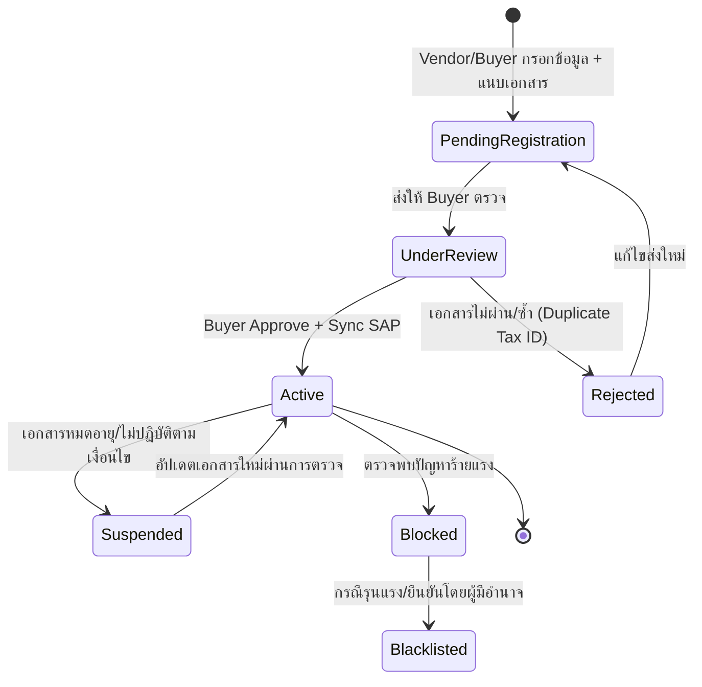

### 3.2 Purchase Requisition (PR) Lifecycle

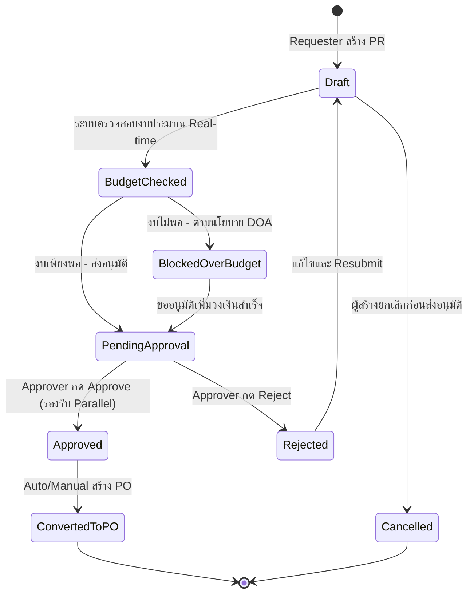

### 3.3 Bidding / RFQ Lifecycle

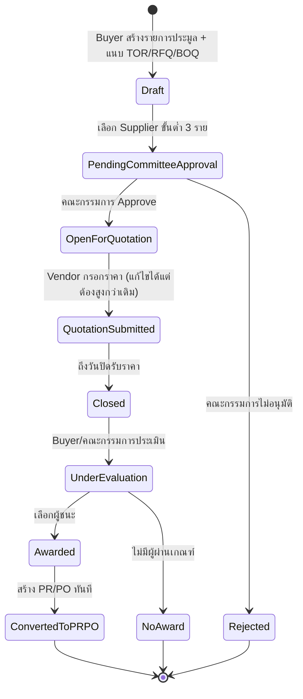

### 3.4 Purchase Order (PO) Lifecycle

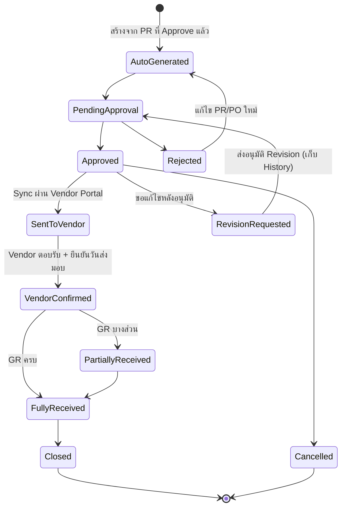

### 3.5 Goods Receipt (GR) Lifecycle

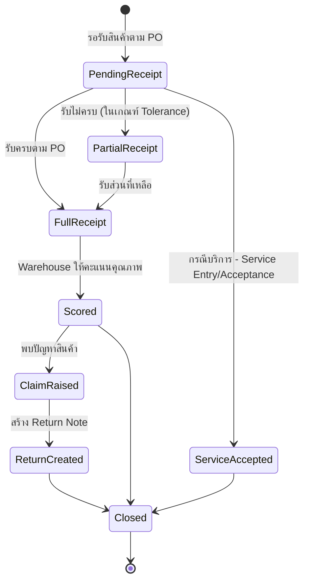

### 3.6 Invoice Lifecycle

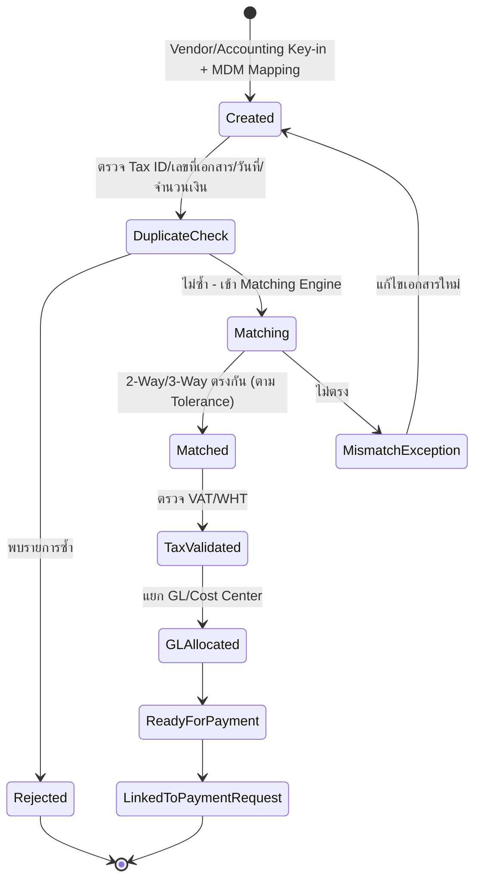

### 3.7 Payment Request / Proposal Lifecycle

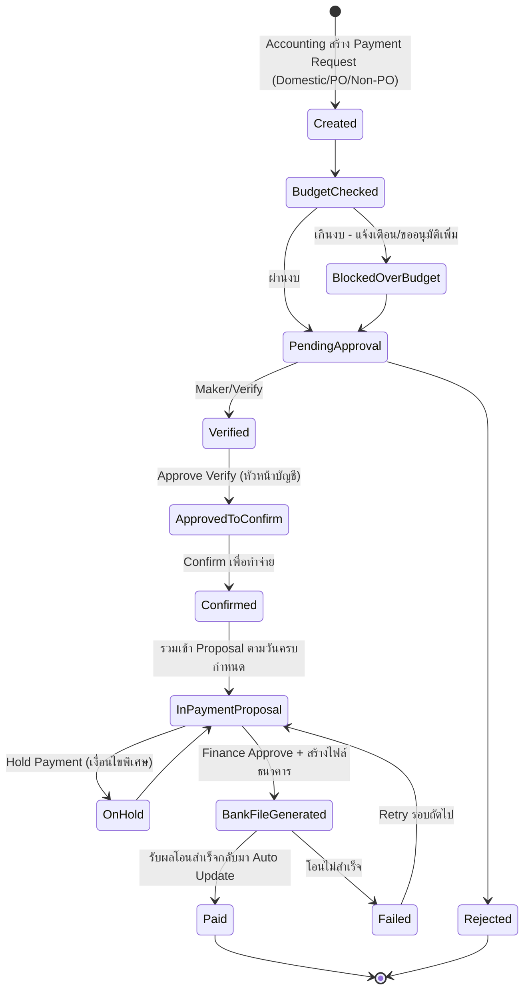

---

## 4. Flow รายโมดูล (Detailed Flow)

แต่ละ Flow ระบุ Actor, Trigger, ขั้นตอนหลัก, Decision Point, Exception Flow, Screen ที่เกี่ยวข้อง (อ้างอิง Screen ID จาก Screen Inventory) และ TOR Reference เพื่อ Traceability 100%

---

### 4.1 [Epic P1-A] Vendor Registration & Verification Flow

**Actors:** Vendor (Portal), Buyer | **Trigger:** Vendor ใหม่ติดต่อเข้ามา หรือ Buyer ต้องการเพิ่ม Vendor เอง
**Screens:** I1 (Vendor Register - Portal), B1/B2 (Vendor List/Profile - Internal), B3 (Vendor Review & Approve)

**Main Flow:**
1. Vendor (ผ่าน Portal) หรือ Buyer (ฝั่ง Internal) กรอกข้อมูลทั่วไป: ชื่อบริษัท, เลขผู้เสียภาษี, ที่อยู่, ประเภทธุรกิจ, ผู้ติดต่อ
2. แนบเอกสารจำเป็น: หนังสือรับรองบริษัท, ภ.พ.20, Book Bank, หนังสือมอบอำนาจ (ถ้ามี)
3. ระบบรัน **Duplicate Check** ทันทีที่กรอก Tax ID (เทียบกับ Vendor เดิมในระบบ + Golden Record)
4. ส่งเข้าสถานะ "รอตรวจสอบ" → เข้าคิวที่หน้า Vendor Review (Buyer)
5. Buyer เปิดดูรายละเอียด + เอกสารแนบ → ตรวจสอบความถูกต้อง
6. Buyer กด **Approve** → ระบบ Activate Vendor + Sync ข้อมูลเข้า SAP B1 (สร้าง Card Code)
7. ระบบบันทึก Vendor เป็น Master Profile ใช้ซ้ำได้ทุก BU (ไม่ต้องกรอกใหม่)
8. ระบบกำหนดวันหมดอายุของเอกสารแต่ละชนิด พร้อมตั้งค่าแจ้งเตือนล่วงหน้า

**Decision Points:**
- Duplicate พบหรือไม่ (Tax ID/ชื่อ/เลขบัญชี) → ถ้าพบ บล็อกการลงทะเบียนซ้ำ แจ้งเตือน Buyer
- เอกสารครบถ้วนหรือไม่ → ถ้าไม่ครบ Reject กลับไปแก้ไข

**Exception Flow:**
- Buyer กด **Reject**: ระบบแจ้ง Vendor ผ่าน Email/Portal พร้อมเหตุผล → Vendor แก้ไขและส่งใหม่ (วนกลับ Step 1)
- เอกสารใกล้หมดอายุ: ระบบแจ้งเตือน Vendor + Buyer ล่วงหน้า → ถ้าไม่อัปเดตตามกำหนด ระบบเปลี่ยนสถานะเป็น **Suspended** อัตโนมัติ
- แก้ไขข้อมูลสำคัญ (บัญชีธนาคาร/ที่อยู่/ภาษี) ของ Vendor ที่ Active แล้ว: ต้องผ่าน Approval Workflow ใหม่อีกครั้ง (Vendor Data Governance) และเก็บ Version History

**TOR Reference:** Sheet 1 No.8,9,10,11,12,18,29,97,98,99,127

---

### 4.2 [Epic P1-A] Product / Item Master Flow

**Actors:** Buyer / MDM Admin | **Trigger:** ต้องการเพิ่มสินค้า/บริการใหม่เข้าระบบ
**Screens:** C1 (Product & Price Management)

**Main Flow:**
1. MDM Admin/Buyer กรอกข้อมูลสินค้า: ชื่อ, ประเภท, รหัส (Auto-generate), หน่วย, ราคา, ช่วงเวลามีผล, รายละเอียด
2. แนบรูปภาพ/ใบเสนอราคาได้ (ทันทีหรือภายหลัง)
3. กำหนดราคาหลายระดับได้ (เช่น ราคาตาม Volume) ผ่านฟังก์ชัน "Adjust" พร้อม Note อ้างอิง
4. กำหนด Owner BU + ตั้งค่าให้ทุก BU เห็นรายการร่วมกัน
5. ระบบ Sync รายการสินค้าเข้า SAP B1 (สร้าง Item Code) — Phase 1 ทำ Sync พื้นฐาน, Multi-BU Code Mapping เต็มรูปแบบอยู่ Phase 2
6. ระบบจัดกลุ่มสินค้าตาม Category Management + ใส่ใน Item Standardization Framework
7. อัปเดตราคาใหม่ → สะท้อนผลใน E-Catalog แบบ Real-time ทันที

**Decision Points:**
- สินค้ามีราคาชัดเจนหรือไม่ → ถ้าไม่ชัดเจน ไปที่ Flow "Catalog & New Product Request" (4.4) เพื่อกรอกราคาเฉพาะกิจ

**Exception Flow:**
- ราคาใกล้หมดอายุ: ระบบแจ้งเตือน + Tag แยกรายการที่ต้องอัปเดต ให้ Buyer เข้าไปปรับราคาก่อนหมดอายุ

**TOR Reference:** Sheet 1 No.1,2,3,4,5,6,20,22,24

---

### 4.3 [Epic P1-A] Multi-Company Master Data Mapping Flow

**Actors:** System Admin / Accounting | **Trigger:** ต้องผูก Item/Vendor 1 รายการเข้ากับหลายบริษัทที่มีรหัส ERP ต่างกัน
**Screens:** (ภายใน C1/B1 — ส่วน "Mapping รหัส")

**Main Flow:**
1. Admin เลือก Item หรือ Vendor ต้นแบบ (Central Code)
2. สำหรับแต่ละบริษัทในเครือ (~15 บริษัท) กำหนดรหัส SAP B1 Code ของบริษัทนั้น ผูกกับ Central Code เดียวกัน
3. ระบบเก็บ Vendor Financial Master, Vendor Type/Business Category แยกตามบริษัทได้
4. Cost Center / Business Unit Hierarchy ผูกเข้ากับ Organization Structure
5. เมื่อมีการทำธุรกรรม (PR/PO/Invoice) ระบบเลือกรหัสที่ถูกต้องตามบริษัทผู้ทำธุรกรรมโดยอัตโนมัติก่อนส่งเข้า SAP B1

**Decision Points:**
- รายการนี้มีรหัสในบริษัทเป้าหมายแล้วหรือไม่ → ถ้ายังไม่มี ต้องสร้าง Mapping ใหม่ก่อนใช้งานข้าม BU

**TOR Reference:** Sheet 1 No.13,14,15,16,17,19,25,128,129,130

---

### 4.4 [Epic P1-B] Catalog Browse & Purchase Requisition (PR) Flow

**Actors:** Requester, Buyer (สำหรับสินค้าใหม่), Approver | **Trigger:** มีความต้องการซื้อสินค้า/บริการ
**Screens:** C2 (Catalog Browse), D1 (PR List), D2 (Create PR)

**Main Flow:**
1. Requester เข้าหน้า Catalog ค้นหาสินค้า (ค้นหาได้แม้ไม่พิมพ์ชื่อเต็ม)
2. ระบบแสดงสินค้า พร้อมชื่อ/รายละเอียด/ราคา และตรวจสอบอายุราคาอัตโนมัติ
3. Requester เลือกสินค้าหลายรายการ (ประเภทเดียวกัน) ลงใน PR เดียว → เห็น Preview Price/Quotation ทันที
4. กรณีไม่มีในสินค้าใน Catalog: Requester "Request สินค้าใหม่" กรอกรายละเอียด จำนวน ราคาประมาณ หน่วยงาน + แนบเอกสาร
5. PR รองรับหลายบรรทัด/หลายหน่วยงาน/หลายศูนย์ต้นทุนในเอกสารเดียว
6. กด **ส่ง PR** → ระบบตรวจสอบ **Budget Real-time** ของ Cost Center ที่เลือก
7. ถ้างบเพียงพอ → ระบบ "กัน" วงเงิน (Reserve Budget) และส่งเข้า DOA Approval Routing ตามนโยบาย/ระดับวงเงินของ BU นั้น
8. Approver (อาจมีหลายระดับ) อนุมัติ → PR เปลี่ยนสถานะ Approved

**Decision Points:**
- สินค้ามีราคา/Vendor ผูกแล้วหรือไม่ → ถ้ามี ไปต่อที่ Flow PO (4.6) ได้ทันที (ไม่ต้องผ่าน Bidding) / ถ้าไม่มีราคาแน่นอนหรือเป็นรายการมูลค่าสูง → เข้า Flow Sourcing/Bidding (4.5)
- Budget พอหรือไม่ → ถ้าไม่พอ ระบบแจ้งเตือน/บล็อก/ให้ขออนุมัติเพิ่มวงเงินตามนโยบาย Procurement Policy ที่ Config ไว้ (เช่น DOA วงเงิน, รายการต้องห้าม)

**Exception Flow:**
- Approver Reject → ระบบแจ้งเตือนผู้เกี่ยวข้องอัตโนมัติ → Requester แก้ไข PR แล้ว Resubmit (วนกลับ Step 6)
- เกินงบประมาณ: ระบบ Block หรือเปิดทางขออนุมัติเพิ่มเติมตาม Policy ที่ตั้งไว้

**TOR Reference:** Sheet 1 No.24,30,31,32,33,34,35,48,49,50,100,101,102,103

---

### 4.5 [Epic P1-C] Vendor Selection & Sourcing Flow (Price Comparison + RFQ/e-Bidding)

**Actors:** Buyer, Approver/คณะกรรมการ, Vendor (Portal) | **Trigger:** PR ที่ Approve แล้วต้องหา Vendor/ราคาที่ดีที่สุด
**Screens:** D3 (Price Comparison), D4 (Bidding/RFQ), I2 (Vendor Submit Quotation)

#### 4.5.1 Price Comparison (กรณีเทียบราคาแบบไม่เป็นทางการ)

1. Buyer ดึงราคาสินค้าจากหลาย Vendor ที่มีอยู่ในระบบ (รวมราคาที่เคยเสนอแต่ไม่ผ่านครั้งก่อน)
2. ระบบแสดงตารางเทียบราคาแยกตาม Vendor แบบ Digital ตามระเบียบจัดซื้อ บันทึกผลไว้เป็นหลักฐาน
3. Buyer เลือก Vendor ที่ดีที่สุด → ไปต่อ Flow PO (4.6)

#### 4.5.2 RFQ / e-Bidding (รูปแบบที่เลือกใช้ใน Phase 1 — ปิดราคา)

1. Buyer สร้างรายการประมูล: รายละเอียดสินค้า, วันปิดรับเสนอราคา, เงื่อนไข, รายชื่อ Supplier ≥3 ราย (ส่งล่วงหน้า ≥2 เดือนก่อนวันเสนอราคา ตามกระบวนการที่ TOR กำหนด)
2. ระบบตรวจสอบบังคับว่าต้องมี Item ผูกอยู่ก่อนเปิดประมูลได้
3. ส่งให้ผู้มีอำนาจ/คณะกรรมการ **Approve** ก่อนเปิดรับราคา
4. เปิดระบบให้ Vendor (ผ่าน Vendor Portal) กรอกราคา — **เห็นเฉพาะของตนเอง**, แก้ไขราคาได้แต่ต้องสูงกว่าครั้งแรกที่เสนอ
5. Buyer เห็นรายการเสนอราคาจากทุก Vendor (Vendor ไม่เห็นของกันและกัน)
6. ถึงกำหนดปิดรับราคา → คณะกรรมการประเมิน/ตัดสิน/ต่อรองราคาเพิ่ม → **Award** ผู้ชนะ
7. ระบบสร้าง **PR และ PO ทันที** จากผลการประมูล (ไม่ต้องสร้างใหม่)
8. การจ่ายเงินให้ Supplier ต้องผ่านการอนุมัติขั้นสุดท้ายของฝั่ง e-Procurement เท่านั้น (ไม่ผ่านได้โดยตรง)

**Decision Points:**
- คณะกรรมการ Approve เปิดประมูลหรือไม่ → ถ้าไม่ Approve กลับไปแก้ไขเงื่อนไข/รายชื่อ Supplier
- หาผู้ขายได้ครบ 3 รายหรือไม่ → ถ้าไม่ครบ ต้องมีเหตุผลประกอบบันทึกในระบบจึงดำเนินการต่อได้

**Exception Flow:**
- ไม่มี Vendor เสนอราคาภายในกำหนด → Buyer ขยายเวลาหรือยกเลิกรอบประมูล (NoAward)
- Vendor เสนอราคาต่ำกว่าครั้งก่อน → ระบบ Block การกรอกซ้ำ (ตามเงื่อนไข "ต้องสูงกว่าครั้งแรก")

> **หมายเหตุ Phase 1:** ใช้ RFQ ปิดราคาเพียงรูปแบบเดียว — Multi-round Bidding, Sealed Bid (แบบ 3), และ Asset Procurement Bidding (แบบ 1 ขายทรัพย์สิน) เลื่อนไป Phase 2

**TOR Reference:** Sheet 1 No.36,37,38,39,40,46,47 / e-Bidding No.2,4

---

### 4.6 [Epic P1-D] Purchase Order (PO) Flow

**Actors:** System (Auto), Buyer, Approver, Vendor (Portal) | **Trigger:** PR Approved หรือ Bidding Awarded
**Screens:** D5 (Purchase Order: List/Create/Approval/Tracking)

**Main Flow:**
1. ระบบดึงข้อมูลจาก PR ที่ Approve แล้ว สร้าง **PO อัตโนมัติ** (Rule-based ตาม DOA)
2. ส่ง PO เข้า Approval Routing (อาจเป็นระดับเดียวกับ PR หรือเพิ่มเติมตามวงเงิน)
3. Approver อนุมัติ PO → ระบบ Sync ข้อมูล PO เข้า SAP B1 (รับเลขที่เอกสาร/สถานะกลับมา)
4. ระบบส่ง PO ให้ Vendor ผ่าน Vendor Portal โดยอัตโนมัติ
5. Vendor เข้า Portal **ตอบรับ PO** และ **ยืนยันวันที่จัดส่งสินค้า**
6. ระบบอัปเดตสถานะ PO เป็น "Vendor Confirmed" พร้อมแจ้งเตือน Buyer/Requester

**Decision Points:**
- ต้องแก้ไข PO หลังอนุมัติหรือไม่ → ถ้าต้องแก้ไข เข้า PO Change/Revision Control Flow (เก็บ Version History ทุกครั้ง) แล้ววนกลับเข้า Approval ใหม่

**Exception Flow:**
- Approver Reject PO → กลับไปแก้ไขที่ระดับ PR/Buyer ก่อนสร้าง PO ใหม่
- Vendor ไม่ตอบรับภายในเวลาที่กำหนด → ระบบแจ้งเตือนซ้ำ (Escalation) ให้ Buyer ติดตาม

**TOR Reference:** Sheet 1 No.52,54,55,107,132

---

### 4.7 [Epic P1-E] Goods Receipt (GR) & Claim/Return Flow

**Actors:** Warehouse/Requester, Buyer | **Trigger:** สินค้า/บริการถูกจัดส่งมาตาม PO
**Screens:** E1 (Goods Receipt), E2 (Claim & Return)

**Main Flow:**
1. Warehouse บันทึก GR ผ่าน Web ตามเลขที่ PO
2. แนบรูปภาพหลักฐานการรับสินค้า (หรือรูปสินค้าเสียหายถ้ามี)
3. รองรับ **Partial Receipt** — รับเกิน/ขาดได้ตามค่าความคลาดเคลื่อน (Tolerance) ที่กำหนดไว้
4. กรณีบริการ: ทำ **Service Entry/Acceptance** ก่อนนำไปวางบิลได้
5. Warehouse/Buyer **ให้คะแนนการรับของ** เพื่อประเมินคุณภาพผู้ขาย (บันทึกรายครั้ง)
6. ระบบ Sync ข้อมูล GR เข้า SAP B1 พร้อมอัปเดต Stock อัตโนมัติ
7. GR ที่สมบูรณ์แล้ว → พร้อมส่งต่อให้ Vendor วางบิล (Flow 4.9)

**Decision Points:**
- รับสินค้าครบตาม PO หรือไม่ → ถ้าไม่ครบ (แต่อยู่ในเกณฑ์ Tolerance) บันทึกเป็น Partial Receipt และเปิดรอรับส่วนที่เหลือ
- พบปัญหาสินค้า/บริการหรือไม่ → ถ้าพบ เข้า Claim Flow

**Exception Flow (Claim & Return):**
1. Requester/Buyer บันทึกเคลม/ร้องเรียน หรือบันทึก Corrective Action
2. สร้างเอกสาร **Return Note** จัดการกระบวนการคืนสินค้า
3. ติดตามสถานะจนปิดเคลม

**TOR Reference:** Sheet 1 No.56,57,58,59,60,61,62,63,108,109

---

### 4.8 [Epic P1-H] Vendor Portal — Consolidated Vendor Journey

**Actors:** Vendor | **Trigger:** Vendor ต้องทำธุรกรรมกับบริษัทผ่านระบบ Self-Service
**Screens:** I1-I5 (Vendor Login/Register, Submit Quotation, PO Response, Invoice Submission, Dashboard)

**Main Flow (มุมมอง Vendor ตลอด Lifecycle):**
1. Vendor สมัครสมาชิก/ลงทะเบียนผ่าน Portal (อ้างอิง Flow 4.1)
2. เมื่อมีการเปิด Bidding ที่ตนถูกเชิญ → Vendor ได้รับ Notification → เข้าระบบกรอกราคา (เห็นเฉพาะของตน)
3. เมื่อ PO ถูก Approve และส่งมาถึง → Vendor เห็น PO ในหน้า Portal ของตน → **ตอบรับ + ยืนยันวันส่งมอบ**
4. หลังจัดส่งสินค้าและถูกบันทึก GR แล้ว → Vendor เข้า **วางบิล/ส่ง Invoice** ผ่าน Portal
5. Vendor ติดตามสถานะ Invoice/Payment ของตนเองผ่าน Vendor Dashboard

**หลักการสำคัญ:** ทุกหน้าจอใน Vendor Portal ต้อง **กรองสิทธิ์ (Scope) ให้เห็นเฉพาะข้อมูลของตนเอง** เท่านั้น (ไม่เห็นราคา/PO/Invoice ของ Vendor อื่น)

**TOR Reference:** อ้างอิงร่วมกับ Sheet 1 No.8,38,54,55 (ไม่เพิ่ม RQ ใหม่ — เป็นมุมมอง UI ของ Function ที่มีอยู่แล้ว)

---

### 4.9 [Epic P1-I] Invoice Creation & Matching Flow

**Actors:** Vendor (ส่ง) / Accounting (Key-in รับ) | **Trigger:** มี GR สมบูรณ์พร้อมวางบิล
**Screens:** F1 (Invoice Creation), F2 (Invoice Matching)

**Main Flow:**
1. Vendor หรือ Accounting สร้างเอกสารวางบิล (Key-in — ไม่มี OCR ใน Phase 1)
2. ระบบ **mapping ข้อมูลจาก MDM** อัตโนมัติ (Vendor/Item/PO) ลดการกรอกซ้ำ
3. รองรับ Document Split & Console และแนบไฟล์หลายประเภท (Multi-Document Attachment)
4. ระบบรัน **Duplicate Invoice Detection** (เทียบเลขที่เอกสาร, ผู้ขาย, วันที่, จำนวนเงิน) ก่อนดำเนินการต่อ
5. เข้า **Invoice Matching Engine**: จับคู่ PO–GR–Invoice แบบ 2-Way หรือ 3-Way ตาม Tolerance ที่กำหนดต่อประเภทสินค้า/กลุ่ม Vendor
6. ผ่าน Matching → ระบบทำ **Tax Validation** (VAT/WHT) รองรับเชื่อมต่อ e-Tax/e-Withholding Tax
7. แยกประเภทค่าใช้จ่าย, GL Account, Cost Center, โครงการ เพื่อเตรียมส่งเข้า SAP B1
8. Invoice พร้อมแล้ว → ส่งต่อสร้าง Payment Request (Flow 4.10)

**Decision Points:**
- พบ Duplicate หรือไม่ → ถ้าพบ Reject ทันที ไม่ให้เข้า Matching
- Matching ตรงกันหรือไม่ (อยู่ใน Tolerance) → ถ้าไม่ตรง เข้าสถานะ Exception ส่งกลับให้แก้ไข/ตรวจสอบ

**Exception Flow:**
- Mismatch: ระบบแจ้งเตือน Accounting พร้อมรายละเอียดส่วนต่าง → ประสานกับ Buyer/Vendor เพื่อแก้ไขเอกสารแล้วนำกลับเข้า Flow ใหม่

**TOR Reference:** Sheet 1 No.69,70,71,111,112,113 (Sheet 2 No.2,10,11,110,221,222,223 ที่ซ้ำ/เกี่ยวเนื่อง)

---

### 4.10 [Epic P1-I] Payment Request & Approval Flow (Segregation of Duties)

**Actors:** Accounting, Finance/Treasury, Approver (หลายระดับ) | **Trigger:** Invoice พร้อมชำระเงิน
**Screens:** F3 (Payment Request), F4 (Payment Proposal & Approval), F5 (Accounting Inbox/Lane)

**Main Flow:**
1. Accounting สร้าง **Payment Request** เลือกประเภท: Domestic — PO หรือ Non-PO (ระบุ Expense Code/Cost Center/IO)
2. ระบบตรวจสอบ **Budget ของ Cost Center** ที่เลือก พร้อมแจ้งเตือนถ้าเกินงบและส่งอนุมัติตามอำนาจ
3. เข้าสาย **Segregation of Duties**: ผู้จัดทำ (Maker) → Verify (บันทึกบัญชี) → Approve Verify (หัวหน้าบัญชี) → Confirm (อนุมัติเพื่อทำจ่าย)
4. เอกสารที่ Confirm แล้ว เข้าคิวรอ **Payment Proposal**
5. ระบบสร้าง Payment Proposal อัตโนมัติตามวันครบกำหนดชำระ พร้อมเงื่อนไขส่วนลดเงินสด (ถ้ามี) และรองรับ **Hold Payment**
6. Finance/Treasury อนุมัติจ่ายขั้นสุดท้าย (แยกหน้าที่จากผู้จัดทำ ตาม SoD)
7. ระบบเชื่อมต่อธนาคารเพื่อสร้าง **ไฟล์โอนเงิน (Bank File)**
8. รับผลการโอนกลับจากธนาคาร → อัปเดตสถานะ Payment เป็น "Paid" อัตโนมัติ

**Decision Points:**
- Budget ของ Cost Center พอหรือไม่ → ถ้าไม่พอ ต้องขออนุมัติเพิ่มเติมก่อนเข้าสาย Approve
- ต้อง Hold Payment หรือไม่ (เงื่อนไขพิเศษ เช่น รอเอกสารเพิ่ม) → ถ้า Hold ค้างใน Proposal จนกว่าจะปลด Hold

**Exception Flow:**
- โอนเงินไม่สำเร็จจากธนาคาร → สถานะ Failed → กลับเข้า Proposal รอบถัดไปเพื่อ Retry
- ผู้อนุมัติ Reject ที่ขั้นใดขั้นหนึ่งในสาย SoD → ส่งกลับไปยังขั้นก่อนหน้าพร้อมแจ้งเหตุผล

**TOR Reference:** Sheet 1 No.73,114,115,116 / Sheet 2 No.1,15,18,19,24,25,26,27,29-41

---

### 4.11 [Epic P1-J] Workflow & Approval (DOA) Engine Flow — Cross-Cutting

**Actors:** System (Rule Engine), Approver | **Trigger:** ทุกเอกสาร (PR/PO/Bidding/Invoice/Payment) ที่ต้องผ่านการอนุมัติ
**Screens:** G1 (Approval Inbox - Web), G2 (Mobile Approve)

**Main Flow:**
1. เอกสารที่ต้องอนุมัติเข้าสู่ **Rule-based Approval Engine** — ระบบคำนวณสายอนุมัติจาก DOA Config (วงเงิน/ประเภทเอกสาร/BU/Company)
2. รองรับ **Parallel Approval** (อนุมัติพร้อมกันหลายคนในขั้นเดียว) และ **Single-step sequential** ตามที่ Config
3. เอกสารปรากฏใน Approval Inbox ของผู้อนุมัติ (Web) และสามารถอนุมัติผ่าน **Mobile** ได้
4. ถ้าผู้อนุมัติไม่ดำเนินการภายในเวลาที่กำหนด → ระบบ **Escalation** ไปยังผู้มีอำนาจระดับถัดไปหรือผู้รักษาการแทนอัตโนมัติ
5. ผู้อนุมัติสามารถตั้ง **Delegation of Authority** ชั่วคราวให้ผู้อื่นอนุมัติแทนได้ (เช่น ลาพักร้อน)
6. ทุก Action (Approve/Reject) ถูกบันทึกในระบบ Status Tracking ที่ดูได้ Real-time
7. กรณี Reject → ระบบแจ้งเตือนผู้เกี่ยวข้องอัตโนมัติเพื่อให้ Revise เอกสารต้นทาง

**Decision Points:**
- วงเงิน/ประเภทเอกสารนี้ ต้องผ่านกี่ระดับ/ใครอนุมัติ → คำนวณจาก DOA Rule Config (Company × BU × Amount × Document Type)
- ผู้อนุมัติ Active หรือลา (มี Delegate) หรือไม่ → ถ้าลา ส่งต่อให้ Delegate ทันที

**Exception Flow:**
- Timeout ไม่มีการอนุมัติ → Escalate ขึ้นไปอีกระดับ พร้อมแจ้งเตือนผู้บังคับบัญชา

**TOR Reference:** Sheet 1 No.92,122,127,135,152,153,154,155,156,157,192 / Sheet 2 No.242-259

---

### 4.12 [Epic P1-K] SAP B1 Integration Flow — Cross-Cutting

**Actors:** System (Integration Layer) | **Trigger:** ทุกครั้งที่มีการสร้าง/อนุมัติ Master Data หรือ Transaction (PR/PO/GR/Invoice/Payment)
**Screens:** H4 (Integration Monitor)

**Main Flow:**
1. ระบบเตรียม Payload จาก Transaction ที่เกิดขึ้น (เช่น PO Approved)
2. ส่งข้อมูลไปยัง SAP B1 ผ่าน API (Master Data: Vendor/Item/GL/Cost Center/Project/Tax Code, หรือ Transaction: PR/PO/GR/Invoice/Payment)
3. SAP B1 ประมวลผลและส่งกลับเลขที่เอกสาร/สถานะ
4. ระบบเก็บเลขที่เอกสาร SAP ไว้คู่กับเอกสารต้นทางในระบบ P2P
5. แสดงสถานะการเชื่อมต่อ (Success/Pending/Error) ที่หน้า Integration Monitor

**Decision Points:**
- การเชื่อมต่อสำเร็จหรือไม่ → ถ้าไม่สำเร็จ เข้า Exception Flow

**Exception Flow:**
- เชื่อมต่อไม่สำเร็จ: ระบบบันทึก Error Log พร้อมรายละเอียด → แสดงสถานะ "Failed" ที่ Integration Monitor → มีกลไก **Retry/Reprocess** ให้ Admin กดส่งซ้ำได้ โดยไม่ต้องสร้างเอกสารใหม่

**TOR Reference:** Sheet 1 No.90,91,93,94,96,118,119,120,121,123 (Sheet 2 No.230,231 ที่ซ้ำ)

---

### 4.13 [Epic P1-L] Reporting & Dashboard Flow

**Actors:** Buyer, Manager | **Trigger:** ต้องการติดตามภาพรวมงานประจำวัน
**Screens:** A1 (Dashboard), A2 (Document Tracking), A3 (Exception Report)

**Main Flow:**
1. ผู้ใช้เข้า Dashboard เห็นภาพรวม PR/PO/GR/Stock แบบ List/Table พื้นฐาน (ไม่ใช่ Custom Dashboard Builder ใน Phase 1)
2. เลือกดู Document Tracking เพื่อติดตามสถานะ Real-time ของเอกสารที่ตนเกี่ยวข้อง
3. ดู Exception Report: รายการค้างอนุมัติ/ค้างรับสินค้า/ค้างวางบิล/ค้างจ่าย
4. Export ข้อมูลเป็น Excel/PDF ได้ตามต้องการ

**TOR Reference:** Sheet 1 No.78,125,126

---

## 5. Cross-Cutting Flow

Flow เหล่านี้ใช้ซ้ำในหลายโมดูล (PR, PO, Invoice, Payment) — ควร implement เป็น Component กลางใน Prototype เพื่อลดงานซ้ำ

### 5.1 Reject & Revision Loop (Generic Pattern)

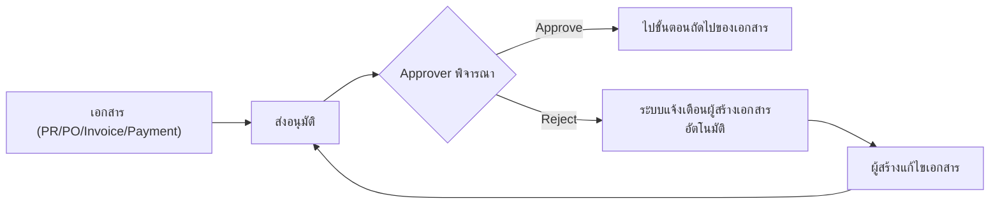

ใช้ Pattern เดียวกันนี้กับทุกเอกสารที่มี state `PendingApproval` — ต่างกันแค่ "ใครอนุมัติ" และ "เอกสารกลับไปแก้ที่ใคร"

### 5.2 Duplicate Detection Pattern (Vendor & Invoice)

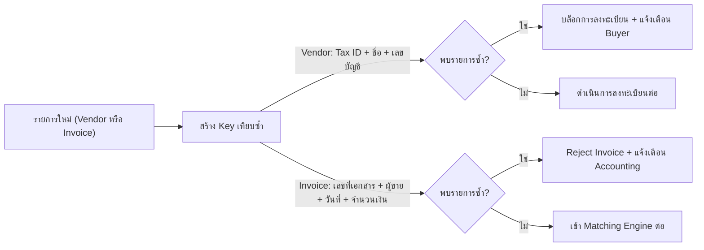

### 5.3 Budget Control Pattern (PR / PO / Payment Request)

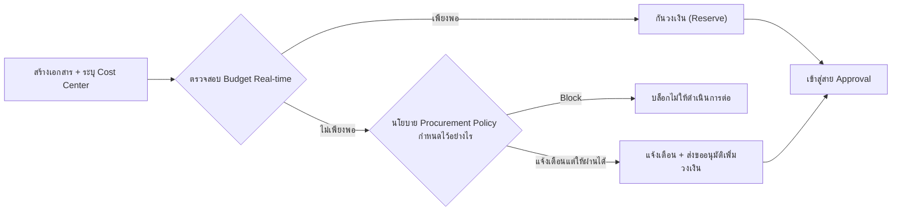

### 5.4 SAP B1 Retry Pattern

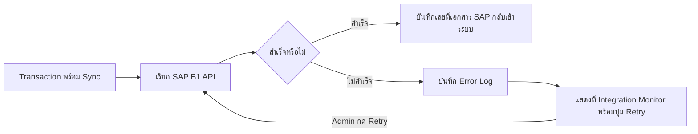

---

## 6. Notification & Trigger Map

| Event ที่เกิดขึ้น | ผู้รับการแจ้งเตือน | ช่องทาง |
|---|---|---|
| PR/PO รออนุมัติ | Approver ตามสาย DOA | Email + In-app Inbox + Mobile |
| PR/PO ถูก Reject | ผู้สร้างเอกสาร (Requester/Buyer) | Email + In-app |
| Vendor ลงทะเบียนใหม่รอตรวจ | Buyer ที่รับผิดชอบ | In-app Inbox |
| Vendor ถูก Reject/ต้องแก้ไข | Vendor (Portal) | Email + Portal Notification |
| เอกสาร Vendor ใกล้หมดอายุ | Vendor + Buyer | Email ล่วงหน้าตามรอบที่ Config |
| Bidding เปิดรับราคา | Vendor ที่ถูกเชิญ | Email + Portal |
| Bidding ผลการประมูล (Award/ไม่ผ่าน) | Vendor ทุกรายที่เข้าร่วม | Email + Portal |
| PO อนุมัติแล้ว ส่งถึง Vendor | Vendor (Portal) | Email + Portal |
| Vendor ยืนยัน PO/วันส่งมอบ | Buyer/Requester | In-app |
| GR บันทึกสำเร็จ | Buyer | In-app |
| เกิด Claim/Return | Buyer + Vendor | Email + In-app |
| Invoice Mismatch (Exception) | Accounting | In-app Inbox + Email |
| Payment Request รออนุมัติ (ทุกระดับ SoD) | ผู้อนุมัติระดับนั้น | In-app + Mobile |
| Payment โอนสำเร็จ/ไม่สำเร็จ | Accounting + Finance | In-app + Email |
| Approval ค้างเกินเวลา (Escalation) | ผู้อนุมัติระดับถัดไป | Email + In-app (เร่งรัด) |
| SAP B1 Sync ล้มเหลว | System Admin | In-app (Integration Monitor) |
| งบประมาณใกล้เต็ม/เกิน | Buyer + Finance ที่เกี่ยวข้อง | In-app + Email |

---

## 7. Decision Point Matrix

สรุปทุกจุดตัดสินใจ (Decision Diamond) ที่ปรากฏซ้ำในระบบ พร้อมเงื่อนไขและผลลัพธ์ — ใช้เป็น Logic Reference ตอน Implement

| Decision Point | เงื่อนไข | ผลลัพธ์ Yes | ผลลัพธ์ No |
|---|---|---|---|
| ต้องเปิด Sourcing/Bidding หรือไม่ | สินค้ามีราคา/Vendor ผูกแล้ว และไม่เข้าเกณฑ์มูลค่าสูง | ข้ามไปสร้าง PO ตรง | เข้า Flow Price Comparison/RFQ |
| Budget เพียงพอหรือไม่ (PR/PO/Payment) | ยอดคงเหลือ Cost Center ≥ ยอดที่ขอ | กันวงเงิน + ไปต่อ Approval | Block หรือขออนุมัติเพิ่มตาม Policy |
| ผู้อนุมัติ Approve หรือไม่ | พิจารณาตามดุลพินิจ/เงื่อนไข DOA | ไปขั้นตอนถัดไปของเอกสาร | กลับไปแก้ไข + แจ้งเตือนผู้สร้าง |
| พบ Vendor ซ้ำหรือไม่ | Tax ID/ชื่อ/เลขบัญชีตรงกับที่มีอยู่ | บล็อกการลงทะเบียน | ดำเนินการลงทะเบียนต่อ |
| พบ Invoice ซ้ำหรือไม่ | เลขที่เอกสาร+ผู้ขาย+วันที่+จำนวนเงินตรงกัน | Reject ทันที | เข้า Matching Engine |
| Invoice Matching ตรงหรือไม่ | อยู่ใน Tolerance ที่ Config ต่อกลุ่มสินค้า/Vendor | ไปต่อ Tax Validation | เข้าสถานะ Exception ส่งกลับแก้ไข |
| รับสินค้าครบหรือไม่ | จำนวนรับ = จำนวนสั่ง (หรือในเกณฑ์ Tolerance) | ปิด GR (Full Receipt) | เปิด Partial Receipt รอรับเพิ่ม |
| ผู้อนุมัติ Active หรือลา | สถานะผู้ใช้ + การตั้ง Delegation | ส่งงานให้ Delegate | รอจนกว่าจะกลับมา/Escalate |
| Approve เกินเวลาที่กำหนดหรือไม่ | เทียบกับ SLA การอนุมัติที่ Config | Escalate ไปอีกระดับ | รออนุมัติตามปกติ |
| SAP B1 Sync สำเร็จหรือไม่ | Response code จาก API | บันทึกเลขที่เอกสาร | บันทึก Error + เปิด Retry |
| Vendor เสนอราคาสูงกว่ารอบก่อนหรือไม่ (RFQ) | เทียบราคาที่กรอกใหม่กับราคาเดิม | อนุญาตให้บันทึก | Block การบันทึก |

---

## 8. Flow → Screen Mapping

ตารางผูก Flow (หมวด 4) เข้ากับ Screen ID (อ้างอิงจาก Screen Inventory เดิมที่ส่งมอบไปก่อนหน้า) เพื่อให้ทีม Build Prototype รู้ว่า Flow แต่ละขั้นต้องมีหน้าจอใด

| Flow | Screen ID ที่เกี่ยวข้อง | ชื่อหน้าจอ |
|---|---|---|
| 4.1 Vendor Registration | I1, B1, B2, B3 | Vendor Register (Portal), Vendor List, Vendor Profile, Vendor Review & Approve |
| 4.2 Product/Item Master | C1 | Product & Price Management |
| 4.3 Multi-Company Mapping | C1 (sub), B1 (sub) | ส่วน Mapping รหัสใน Master |
| 4.4 Catalog & PR | C2, D1, D2 | Catalog Browse, PR List, Create PR |
| 4.5 Sourcing & Bidding | D3, D4, I2 | Price Comparison, Bidding/RFQ, Vendor Submit Quotation |
| 4.6 Purchase Order | D5 | PO List / Create PO / PO Approval / Tracking & Delivery |
| 4.7 GR & Claim | E1, E2 | Goods Receipt, Claim & Return |
| 4.8 Vendor Portal Journey | I1, I2, I3, I4, I5 | Vendor Login/Register, Submit Quotation, PO Response, Invoice Submission, Vendor Dashboard |
| 4.9 Invoice & Matching | F1, F2 | Invoice Creation, Invoice Matching |
| 4.10 Payment Request & Approval | F3, F4, F5 | Payment Request, Payment Proposal & Approval, Accounting Inbox/Lane |
| 4.11 Approval Engine | G1, G2 | Approval Inbox (Web), Mobile Approve |
| 4.12 SAP Integration | H4 | Integration Monitor (SAP status + Retry) |
| 4.13 Reporting/Dashboard | A1, A2, A3 | Dashboard, Document Tracking, Exception Report |

---

## 9. Phase 2-4 Flow Preview (ภาพรวมสั้น)

ไม่อยู่ในขอบเขต Prototype รอบนี้ — ใส่ไว้เพื่อให้เห็นภาพรวม "ระบบทั้งหมด" ตาม Vision เดิม และเผื่อออกแบบ Data Model/UI ให้ขยายต่อได้ในอนาคตโดยไม่ต้อง Refactor ใหญ่

### Phase 2 — P2P Enhancement & Compliance
- Bidding ขยายเป็น Multi-round, Sealed Bid, Asset Procurement Bidding (แบบขายทรัพย์สิน), Weighted Scoring เต็มรูปแบบ
- Vendor Evaluation Framework เต็มรูป (ประเมินรายปี, แจ้งผล Vendor, Audit ตรวจสอบได้)
- Custom Dashboard Builder + Spend Analytics + Price Trend (ต่อยอดจาก Reporting พื้นฐานใน Phase 1)
- Digital Contract & Signature เต็มรูปแบบ
- AP ขั้นสูง: Payment Batch Run, Foreign Payment, Reverse/Block/Unblock ผ่าน API

### Phase 3 — Employee to Payment (ESS)
- Flow แยก Domain จาก P2P สิ้นเชิง: Travel Authorization → Advance → Expense Claim → Reimbursement → Foreign Remittance/Medical
- Workflow Inbox & History เฉพาะฝั่งพนักงาน (คนละ Inbox จาก Buyer/Accounting)

### Phase 4 — AI Enablement
แทนที่จุด Manual/Rule-based เดิมด้วย AI ใน 9 จุด: AI Market/Vendor Scraping (ก่อน Sourcing), AI Social Listening Suggestion, Smart DOA (ต่อยอด Rule-based Engine เดิม), AI Detection ตอนรับสินค้า, AI Replenishment Suggestion, OCR Engine (แทน Key-in Invoice), AI Metadata & Indexing, AI Suggestion จากผล Evaluation

> **ข้อแนะนำเชิง Design:** เผื่อ field/hook ใน Data Model และ UI ไว้รองรับจุดเหล่านี้ (เช่น field `source: manual|ai_suggested` ใน Recommendation, หรือ placeholder panel "AI Insight" ที่ปิดไว้ก่อน) จะช่วยให้ขยายเข้า Phase 4 ได้ง่ายขึ้นในอนาคต โดยไม่ต้องรื้อโครงสร้าง

---

## 10. Assumption & Open Items สำหรับ Prototype

เนื่องจาก Flow ในเอกสารนี้อ้างอิงจาก TOR ฉบับล่าสุดซึ่งมีบางจุดต้องยืนยันกับลูกค้า ผมตั้ง Assumption ดังนี้เพื่อให้ Build Prototype ได้ต่อเนื่องโดยไม่ติดค้าง:

1. **SAP B1 Integration/MDM** — Assume เป็น **Must** ตาม TOR (ไม่ใช่ Exclude ตาม Quotation เดิม) → ทุก Integration ใน Flow นี้ทำเป็น **Mock Layer** ที่ Return ผลลัพธ์สมจริง
2. **Bidding Phase 1** — ใช้ **RFQ ปิดราคาเพียงรูปแบบเดียว** (ตัด Sealed Bid และ Asset Bidding ไปก่อน)
3. **Pilot Scope** — Flow ออกแบบให้รองรับ Multi-company ในระดับ Data Model แต่ Prototype Demo จะ Seed ข้อมูลแค่ **1-2 BU นำร่อง** เพื่อความง่ายในการ Demo
4. **AI Touchpoints** — ทุกจุดที่เดิมเป็น AI ใน Diagram (Vision Roadmap) ถูกแทนด้วย **Rule-based/Manual** ทั้งหมดใน Flow นี้ ตามมติ Re-plan ของโครงการ
5. **OCR สำหรับ Invoice** — Phase 1 ใช้ **Key-in เท่านั้น**, ไม่มี OCR Integration
6. **Payment Foreign/Alternative Payee** — รวมไว้ใน Data Model แล้ว แต่ Flow รายละเอียดยังไม่ลงลึกเท่า Domestic (เพราะ Priority รองใน TOR)
7. **Notification Channel จริง** (Email/Line/Teams ตาม Diagram เดิม) — Prototype จะ Mock เป็น In-app Notification Center ก่อน ยังไม่ต่อ SMTP/Line API จริง

---

*เอกสารนี้จัดทำเพื่อใช้เป็น Input หลักในการ Build Prototype ด้วย Antigravity — ใช้คู่กับเอกสาร Screen Inventory, Data Model (ERD), และ Design Language ที่ส่งมอบก่อนหน้านี้ เพื่อให้ได้ภาพระบบที่สมบูรณ์ทั้ง Flow, โครงสร้างข้อมูล, และหน้าตา UI*
